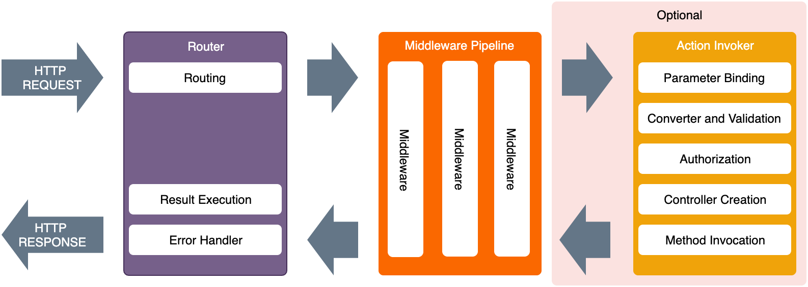

When an Http Request issued into Plumier application, the process goes through a series of processing steps that can be categorized into three main process. Infographic picture below showing the various stage of Plumier Application Life Cycle.

## Router 
Router is the main process during the occurrence of the http request. There three main process inside router are: 

### Routing
Routing will parse the request URL into path and query object using RegEx and specify the correct controller that will handle the request. 

There are `Context` variable (`ctx`) initialized during this phase. `ctx` accessible from middleware using `invocation.context`

1. `ctx.route` contains route metadata information such as controller name, current method name, parameters, route etc. The value can be `undefined` if the current request doesn't associated with any controller.
2. `ctx.request.query` contains request query string in query form. 
3. `ctx.config` contains Plumier application configuration.
4. `ctx.routes` contains all routes metadata information, this values got during route generation process on initialization process.

All above context property only accessible within process after the routing. 

## Result Execution 
Router executes middleware pipeline and wait for the returned `ActionResult`. Action result contains raw values will be used to render the Http Response. 

## Middleware Pipeline 

## Action Invoker

1. Http Request 
2. Router & Global Error Handler { ctx.route, ctx.request.query, ctx.config, ctx.routes }
3.  Middleware pipeline 
4.  Parameter Binding { ctx.parameters (raw value) }
5.  Converter & Validation  { ctx.parameters (cleansed value) }
6.  Custom Authorization Creation
7.  Authorization
8.  Controller Creation
9.  Method Invocation
10. Result Execution
11. Http Response