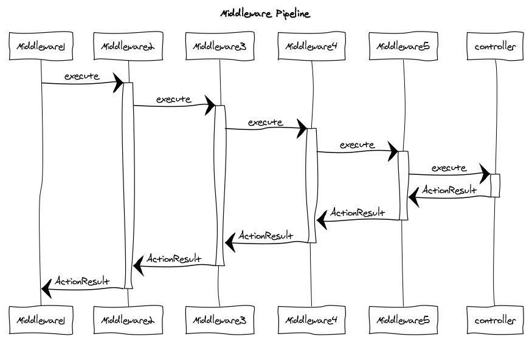
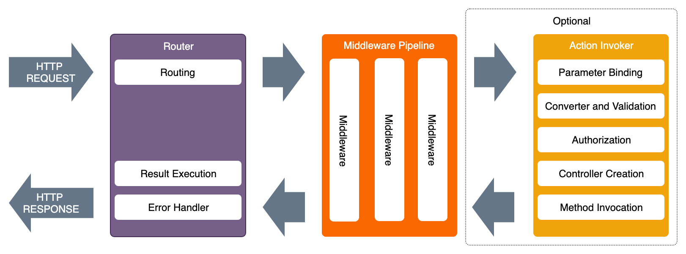

This documentation covers most of advanced Plumier functionalities. By reading this documentation you will be able to extends the framework functionalities to give plumier a new ability.

Plumier has some built-in functionalities such as validators, parameter binders, authorizer etc. If those functionalities doesn't fit your needs, you can extends Plumier capability by providing your own custom extension. Plumier provided some interfaces contract to easily extend its capability.

There are some knowledge base you need to know to make a better understanding on how things work inside the framework before start creating custom extension.


## Plumier Middleware in a Nutshell
The term of middleware in Plumier is the same as in other framework such as Express and Koa. All functionalities (validator, authorization, parameter binding etc) in Plumier are implementation of middleware. 

Unlike Express middleware Plumier middleware used a modern pipeline, instead of using a chain of callback Plumier middleware used chain of promise (async/await) executed from one to another waiting the execution result of the next middleware. 



This pipeline has better execution control than Express, because the previous middleware free to await the next middleware execution or return a new `ActionResult` immediately and stop the execution pipeline without touching the controller. 

This behavior very important for some functionalities such as Validation and Authorization where middleware can stop the pipeline execution immediately when some state doesn't match the preferred condition and returned error message immediately. 

This behavior also has better error handling because API programmer free to throw error anywhere inside middlewares or controllers because its guaranteed will be caught by the higher middleware.

Simplest custom middleware example is like below

```typescript
class MyCustomMiddleware implements CustomMiddleware {
    execute(inv:Invocation){
        return inv.proceed()
    }
}
```

Above code showing a simplest custom middleware it does nothing except execute the next middleware and pass the result into the higher middleware. 

```typescript 
const myCustomMiddleware:CustomMiddlewareFunction = inv => inv.proceed()
```

Above code is another version of middleware, its created using functional custom middleware, it has the same behavior with the previous example.

`Invocation` is an object represent the next process will be invoked by the middleware. It has `proceed()` method used to execute the next process and returned the execution result `Promise<ActionResult>`. Invocation has `ctx` property which is the Context useful to get current request information.

## Context 
Context in Plumier (usually the variable named `ctx`) is derived from [Koa context](https://github.com/koajs/koa/blob/master/docs/api/context.md), it encapsulate `HttpRequest` and `HttpResponse` object into a single object, it mostly used in every custom extension. 

Context can be accessed from inside controller using parameter binding `@bind.ctx()` or from inside any custom extension. Even though Context has tons of properties, usually only a few will be used, here are list of most used properties: 

1. `ctx.request.body` the request body. Don't confuse with `ctx.body` because its the response body. 
2. `ctx.query` or `ctx.request.query` the request query case insensitive. Can be access using `ctx.query.myQuery`, `ctx.query.MYQUERY`, `ctx.query["myquery"]` or `ctx.query["MYQUERY"]`  
3. `ctx.header` or `ctx.request.header` the request header.
4. `ctx.cookies` the cookie
5. `ctx.state.user` the current login user (JWT claim)
6. `ctx.config` the Plumier application configuration
7. `ctx.route` the current route information, contains metadata information of current controller or action handles the request. For request doesn't associated with controller the value will be `undefined`.
8. `ctx.routes` array of all route information used by the route generator. 
9. `ctx.parameters` array of value that will be bound to controller's method. The value arranged in a correct order match with methods parameter. This property only available on controller/method middleware

For a complete reference about Context and its properties can be found in [Koa documentation](https://github.com/koajs/koa/blob/master/docs/api/context.md). 

## Application Lifecycle
When an Http Request issued into Plumier application, the process goes through a series of processing steps categorized into three main process like picture below.



The execution process start from the left to right to pass the request that will be processed by controller and then returned back from right to left for the controller execution result that will be rendered into http response.

All the child process of the Middleware Pipeline is extensible by using custom extension with specific registration:
1. Custom global middleware middleware registered using Plumier application during the application bootstrap using `app.use()` method.
2. Custom parameter binding registered on the appropriate parameter using `@bind.custom()` decorator.
3. Custom validator registered on the appropriate parameter or domain model property using `@val.custom()` decorator.
4. Custom authorization registered on appropriate controller, methods, parameter or domain model properties on deep nested property using `@authorize.custom()` decorator.
5. Controller/method middleware register on controller or method using `@middleware.use()` decorator. 

Note that the execution order of the child process of the middleware pipeline is important. The execution start from left to right so global middleware has more control than the other process. 

The execution order also affect the `ctx.parameters` value which will only available after Parameter Binding process, so global middleware will not be able to access them. 

## Custom Middleware
There are two kind custom middlewares: Global middleware and Controller/method middleware. Technically both are the same but there are some distinction between them: 
1. `ctx.route` accessible in both, but in global middleware the value is optional (can be `undefined`), because global middleware kept executed even the request doesn't has appropriate controller.
2. `ctx.parameters` with cleansed value (converted/validated) only accessible from controller/method middleware
3. Controller/method middleware will never touched when there are validation error or authorization error occur.
4. Global middleware derived from `CustomMiddleware` or `CustomMiddlewareFunction`. Controller/action middleware derived from `CustomMiddleware<ActionContext>` or `CustomMiddlewareFunction<ActionContext>`.

### Example Global Middleware
Global middleware always executed on every request, this behavior can be used to create a virtual endpoint without having a controller that handle the request. For example we create the `/hello-world` endpoint and returned a JSON. 

```typescript
const sayHello:CustomMiddlewareFunction = async inv => {
    if(inv.ctx.path.search(/^\/hello-world/i) > -1)
        return new ActionResult({ message: "Hello World" })
    else 
        return inv.proceed()
}
```

Register the middleware from the Plumier application like below

```typescript
new Plumier()
    .set(new WebApiFacility())
    .use(sayHello)
```

Above code will handle the `/hello-world` then return an `ActionResult` immediately if the path match the criteria else the next invocation executed.

### Example Controller/Method Middleware 
Controller/Method middleware has access to the `ctx.route` and `ctx.parameters`. This property best used for programming. On this example will will create a logging middleware to print the controller name, method name, the parameters applied and the time used to complete the request. 

```typescript 
const metaLog:CustomMiddlewareFunction<ActionContext> = async inv => {
    const start = new Date()
    const result = await inv.proceed()
    const time = (new Date().getTime() - start.getTime())/1000
    console.log("Controller:", ctx.route.controller.name)
    console.log("Method:", ctx.route.action.name)
    console.log("Parameters:", ctx.parameters)
    console.log("Execution Time:", time)
    return result;
}
```

Register the middleware on top of Controller 

```typescript
@middleware.use(metaLog)
class AnimalsController {
    @route.get(":id")
    get(id:number) { }

    @route.post("")
    save(data:Animal){ }

    @route.put(":id")
    modify(id:number, data:Animal){ }
}
```

Above code showing that the middleware applied on the controller, its mean it will log the controller name, method name etc when all the three endpoints (`GET /animals/:id` `POST /animals` `PUT /animals/:id`) accessed. 

## Custom Parameter Binding 
Custom parameter binding extends the parameter binding functionalities, signature of custom parameter binding is like below

```typescript 
type CustomBinderFunction = (ctx:Context) => any
```

Custom parameter binder receive single parameter which of type Context and return the value that will be bound to the parameter. 

```typescript
const authHeader:CustomBinderFunction = ctx => ctx.request.header.Authorization 

class AnimalsController {
    @route.get(":id")
    get(id:number, @bind.custom(authHeader) auth:string) { }
}
```

Above code will bind the `auth` parameter with the `Authorization` header.


## Custom Validator 
Custom validator extends Plumier validator functionalities. For example we want to create adult age restriction validation, the implementation simply like below

```typescript
const isAdult:CustomValidatorFunction = val => {
    if(parseInt(val) < 18)
        return "Sorry you're not ready to view the content"
}
```

Custom validator can be applied on controller's method parameter or on domain property. 

```typescript
@domain()
class LoginUser {
    constructor(
        public userId:number,
        public role:string,
        @val.custom(isAdult)
        public age:number
    ){}
}
class PictureController {
    @route.get()
    adult(@bind.user() user:LoginUser) {
        return response.file(__dirname, "path/of/adult_image.jpg")
    }
}
```

Above code will restrict access to the `GET /picture/adult` endpoint by validating the `age` property of the current login user provided by the JWT token claim.

Refer to the [custom validator documentation](extends/custom-validator) for more info.

## Custom Authorization 
Custom authorization extends Plumier authorization functionalities. This custom extension useful when you want to secure an endpoint based on specific data. 

For example an online marketplace user free to create their own shop and assigned as the `ShopAdmin` by default, further more they can assign another user as `Staff`. 

Above logic is impossible when implemented using default Plumier authorization because user role is dynamic based on data. Here are example of the Shop controller. 


```typescript
class ShopsController {
    @route.post("")
    save(data:Shop) { }

    @route.get(":shopId")
    get(shopId:number) { }

    @route.put(":shopId")
    modify(shopId:number, data:Shop) { }

    @route.delete(":shopId")
    delete(shopId:number) { }
}
```

The expected endpoint access is like below:

| Endpoint                 | Authorize        | Description                                          |
| ------------------------ | ---------------- | ---------------------------------------------------- |
| `POST    /shops`         | Authenticated    | All login user can create new shop                   |
| `GET     /shops/:shopId` | Public           | All user login or non login can show                 |
| `PUT     /shops/:shopId` | ShopAdmin, Staff | Only Admin and Staff of the shop (shopId) can modify |
| `DELETE  /shops/:shopId` | ShopAdmin        | Only Shop Admin can delete the shop                  |


Implementation of the custom authorizer is like below:

```typescript
function shopUser(...roles: ("ShopAdmin" | "Staff")[]) {
    return authorize.custom({ ctx, user }) => {
        //find the shopId position on the metadata
        const parIdx = ctx.route.action.parameters.findIndex(x => x.name === "shopId")
        if (parIdx === -1) 
            throw new Error("Method handle the request doesn't have shopId parameter")
        //use the index to get the shopId value
        const shopId = ctx.parameters[parIdx]
        //get the current login userId
        const userId = ctx.state.user.userId
        //get the user role associated to the shop on the database
        const shopUser = await ShopUserModel.find({ shopId, userId })
        //check if the role match any of the authorized roles
        return roles.some(x => x === shopUser.role)
    })
}
```

Above code showing that we create a custom authorizer by directly returned the `@authorize.custom()`, its mean the `shopUser` function is a custom decorator that can be applied on controller or method. 

Above authorizer reads the metadata information of current request to check wether the method has parameter named `shopId` and extract the shopId value from the `ctx.parameters`. By using this trick this decorator can be reuse in any method has parameter named `shopId`.

Custom authorizer above can be applied easily on the previous controller.


```typescript
class ShopsController {
    @route.post("")
    save(data:Shop) { }

    @authorize.public()
    @route.get(":shopId")
    get(shopId:number) { }

    @shopUser("ShopAdmin", "Staff")
    @route.put(":shopId")
    modify(shopId:number, data:Shop) { }

    @shopUser("ShopAdmin")
    @route.delete(":shopId")
    delete(shopId:number) { }
}
```
