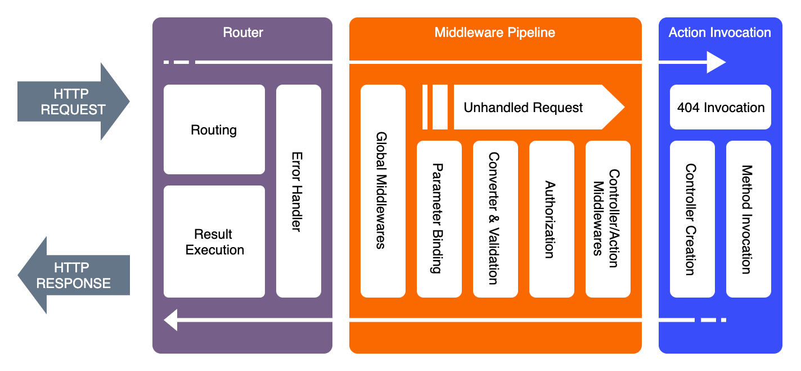

## Application Lifecycle



## Reflection 
Most Plumier magical process such as [route generation](refs/route), [parameter binding](refs/parameter-binding) uses reflection internally. Plumier uses TypeScript compiler feature to be able to extract TypeScript types information during runtime. Thus the options need to be enabled when using Plumier: `experimentalDecorators` to enable the usage of experimental decorators and `emitDecoratorMetadata` to enable the type declaration emit. Using above feature plumier has a [powerful library](https://github.com/plumier/tinspector) to introspect the type information during runtime. 

```typescript 
import reflect from "tinspector"

class AuthController {
    @route.post()
    login(userName:string, password:string){}
}

const metadata = reflect(AuthController)
```

`metadata` variable on above code will supplied with `AuthController` metadata such as: Class Name, Method Name, method return value data type, list of method parameters and its data type, list of decorators on the class method or parameter etc.

Note that to be able to get the type information of parameters and properties, its required to use at least a decorator on the appropriate parameter or property. 

```typescript 
class Animal {
    constructor(
        public name:string,
        public breed:string,
        public dateOfBirth:Date
    ){}
}

const metadata = reflect(AnimalController)
```

Above code will able to get the property parameter name `name`, `breed` and `dateOfBirth` but failed to get the data type (`number`). To do that add `@domain()` decorator to make it work properly 

```typescript 
import {domain} from "plumier" 

@domain()
class Animal {
    constructor(
        public name:string,
        public breed:string,
        public dateOfBirth:Date
    ){}
}

const metadata = reflect(AnimalController)
```

## Request Context 

## Custom Validator 

## Custom Authorization 

## Custom Parameter Binding 

## Custom Middleware