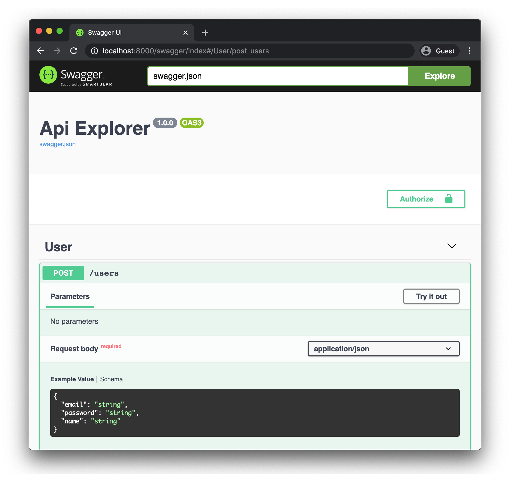

Plumier is A TypeScript backend framework focuses on development productivity to help you create a robust, secure and fast Node.js restful API delightfully. Plumier shipped with some built-in feature to speed up your API development.

## First Class Entity

A first class entity is an ORM Entity with control to most framework functionalities (validation, authorization, data type schema, generated restful API). On the background Plumier creates a generic controller on the fly for each first class entity to create CRUD restful API for each entity.

#### Simplest First Class Entity

Plumier supported TypeORM entity to be used as first class entity, simplest implementation of first class entity is like below.

```typescript {6}
import { route, val} from "plumier";
import { Column, Entity, PrimaryGeneratedColumn } from "typeorm";

// create generic controller based on Item entity on the fly.
// handles restful API post, put, patch, delete, get (by id), get (list)
@genericController()
@Entity()
export class Item {
    @PrimaryGeneratedColumn()
    id: number;

    @Column()
    name: string;

    @Column()
    basePrice: number;

    @Column()
    price: number;
}
```

Above code generated into six restful routes like below.

| Method | Path         | Description                                                 |
| ------ | ------------ | ----------------------------------------------------------- |
| POST   | `/items`     | Create new item                                             |
| GET    | `/items`     | Get list of items with paging, filter, order and projection |
| GET    | `/items/:id` | Get single item by id with projection                       |
| PUT    | `/items/:id` | Replace item by id                                          |
| PATCH  | `/items/:id` | Modify item by id (required validation ignored)             |
| DELETE | `/items/:id` | Delete item by id                                           |

#### Nested Restful API

ORM entities may contains relations to represent join to another table, Plumier provided nested generic controller to perform parent children operation.

```typescript {11}
import { route } from "plumier"
import { Entity, OneToMany, PrimaryGeneratedColumn } from "typeorm"

@Entity()
export class Post {
    @PrimaryGeneratedColumn()
    id: number

    /** other properties **/

    @genericController()
    @OneToMany(x => Comment, x => x.post)
    comments: Comment[]
}

@Entity()
export class Comment {
    @PrimaryGeneratedColumn()
    id: number

    @Column()
    comment:string

    @ManyToOne(x => Post, x => x.comments)
    post:Post
}
```

Above code showing that the relation property `comments` marked with `@genericController()` decorators. It tells Plumier to create a nested generic controller to perform parent children operation. Above code will generated into routes below.

| Method | Path                       | Description                                                           |
| ------ | -------------------------- | --------------------------------------------------------------------- |
| POST   | `/posts/:pid/comments`     | Create new post's comment                                             |
| GET    | `/posts/:pid/comments`     | Get list of post's comments with paging, filter, order and projection |
| GET    | `/posts/:pid/comments/:id` | Get single post's comment by id with projection                       |
| PUT    | `/posts/:pid/comments/:id` | Replace post's comment  by id                                         |
| PATCH  | `/posts/:pid/comments/:id` | Modify post's comment property by id                                  |
| DELETE | `/posts/:pid/comments/:id` | Delete post's comment by id                                           |


#### First Class Entity Security 

Entities may contains properties that sensitive to some type of users, you may need to restrict user to access specific API endpoint or even you may need to restrict user to set/see specific property on request or response body. 

Plumier provided declarative authorization by specifying authorization policy name that can be applied to secure API endpoints, property of request/response body etc. Furthermore you define the authorization policy logic separately.

```typescript {4,15,20}
@genericController((config) => {
    // authorize Supervisor and Staff 
    // can mutate (post, put, patch, delete) the resource
    config.mutators().authorize("Supervisor", "Staff");
})
@Entity()
export class Item {
    @PrimaryGeneratedColumn()
    id: number;

    @Column()
    name: string;

    // authorize response body property only can be seen by Supervisor and Staff 
    @authorize.read("Supervisor", "Staff")
    @Column()
    basePrice: number;

    // authorize request body property only can be set by Supervisor and Staff 
    @authorize.write("Supervisor")
    @Column()
    price: number;
}
```

Code above showing that `Supervisor` and `Staff` is an authorization policy. Next you define your authorization policy logic using authorization policy builder like below. 

```typescript
import { authPolicy } from "plumier"

// register policies (role) with authorization policy builder
authPolicy()
    // register Supervisor
    .register("Supervisor", ({ user }) => {
        // user is the JWT claim from request header
        return user?.role === "Supervisor"
    })
    // register Staff
    .register("Staff", ({ user }) => {
        return user?.role === "Staff"
    })
```

You register the authorization policy by providing the policy name and an authorization callback. The callback will be called during authorization evaluation. 

#### Auto Generated Values

Entities may contains properties that is auto generated, such as `createdBy` property that needs to automatically assigned with the current login user ID. 

Furthermore you may need to restrict anyone to set the `createdBy` property from the request body.

```typescript 
@genericController()
@Entity()
export class Item {
    @PrimaryGeneratedColumn()
    id: number;

    // restrict user to set property from request body
    @authorize.readonly()
    // created date column provided by TypeORM
    @CreateDateColumn()
    createdAt: Date
    
    // restrict user to set property from request body
    @authorize.readonly()
    @Column()
    createdBy:User

    // executed method before entity saved, only on post request
    @preSave("post")
    // bind user parameter with the JWT claim from request header
    assignUser(@bind.user() user:LoginUser){
        // assign createdBy with current login user from JWT claim
        this.createdBy = <User>{ id: user.userId }
    }
}
```

Code above showing that we use the request hook `@preSave()` to make the `assignUser` method executed before the entity being saved to the database. 

#### Define Filterable Fields
Generic controller provided functionalities to refine the API response, such as filter, paging, order and projection. 

```typescript 
import { route, authorize } from "plumier"
import { Entity, Column, CreateDateColumn, PrimaryGeneratedColumn } from "typeorm"

@genericController()
@Entity()
export class Post {
    @PrimaryGeneratedColumn()
    id: number

    @Column()
    slug:string

    @Column()
    title:string

    @Column()
    content:string

    @CreateDateColumn()
    createdAt:Date
}
```

Using above code we can query filter for all Post fields. Using above generated API you may request like below.

```
# Filter response based on slug property using equals comparison
GET /posts?filter=(slug = 'my_cool_post')

# Perform range filter between dates using triple dots
GET /posts?filter=(createdAt = '2020-9-1'...'2020-10-1')

# Perform conditional filter 
GET /posts?filter=(createdAt >= '2020-9-1' and deleted = false)

# Perform search on title that starts with word programming using asterisk
GET /posts?filter=(title = 'programming'*)
```

Filter will follows the `@authorize.read()` and `@authorize.writeonly()` respectively. Its mean when user doesn't have proper read access the query will returned 401.

:::info documentation
For more information about first class entity and generic controller can be found [here](Generic-Controller.md)
:::

## Validators

Plumier provided comprehensive list of validator, uses [ValidatorJS](https://www.npmjs.com/package/validator) internally. You specify validation using `@val` decorator. 

```typescript {9-11,15,19}
import { val } from "plumier"
import { Entity, Column, CreateDateColumn, PrimaryGeneratedColumn } from "typeorm"

@Entity()
export class User {
    @PrimaryGeneratedColumn()
    id: number

    @val.email()
    @val.unique()
    @val.required()
    @Column()
    email: string

    @val.required()
    @Column()
    name:string

    @val.url()
    @Column()
    profilePicture:string
}
```

There are more than 40 validators to use to secure your API consumer request. 

:::info documentation
Refer to [validator documentation](Validation.md) for more information 
:::

## Common Controller

Generic controller is just an implementation of Plumier controller with generic class signature. Even though generic controller can be fully customized to match your app requirements, in some case its may required to use a controller manually to handle user request. 

The term of Controller in Plumier is the same as in other MVC framework. Plumier controller is a plain class end with `Controller` for example `class UsersController`. A route automatically generated based on `/controller/action`. This behavior can be customized using `@route` decorator.

```typescript
import { route } from "plumier"

export class UsersController {
    // GET /users/:id
    @route.get(":id")
    get(id:string) { 

      // return value or Promise that 
      // automatically rendered into JSON response
      return repo.findOne(id)
    }
}
```

Controller can return any value including `Promise`, this value then rendered into JSON response automatically. You can have more control to the response by returning the `ActionResult` or use the built-in `response` function.

| Action                 | Alias                 | Description                | Package                 |
| ---------------------- | --------------------- | -------------------------- | ----------------------- |
| `ActionResult`         | `response.json()`     | Return json response       | `plumier`               |
| `RedirectActionResult` | `response.redirect()` | Redirect response          | `plumier`               |
| `FileActionResult`     | `response.file()`     | Serve static file response | `@plumier/serve-static` |


#### Bind Request Part Into Action's Parameter
Action parameter can be bound into request part such as query, body, header etc. Request values received automatically converted into data type match with action parameter data type. 

```typescript
import { route } from "plumier"

export class UsersController {
    // GET /users/list
    @route.get()
    list(offset:number = 0, limit:number = 50, active:boolean = true) {
        
    }
}
```

Above controller generated into `GET /users/list?limit&offset&active`. All parameters are optional with their default values. Note that the value automatically converted match with parameter data type, giving these request are valid

```
GET /users/list 
GET /users/list?limit=20
GET /users/list?offset=20&limit=20
GET /users/list?offset=10&active=true
GET /users/list?active=1
```

Important to notice that boolean parameter can be filled with: `yes`, `no`, `true`, `false`, `1`, `0`. And parameter of type datetime can be filled with `2020-12-31` or `2020-10-05T23:28:33.598Z` 

Parameters also can be bound with request body by providing a parameter of type of custom object to hold the request body like example below

```typescript
import { route, domain } from "plumier"

@domain()
export class Login {
    constructor(
        public email:string,
        public password:string,
    ){}
}

export class AuthController {
    // POST /auth/login
    @route.post()
    login(data:Login) {
        
    }
}
```

Above controller will be generated into `POST /auth/login` with request body `{ "email":<string>, "password": <string> }` 

Plumier provided decorators to bind specific request body to parameter, you can use the `@bind` decorator on specific parameter. 

```typescript {6}
import { route, bind } from "plumier"

export class UsersController {
    // GET /users/:id
    @route.get(":id")
    get(id:string, @bind.user() user:LoginUser) { }
}
```

Here are list of supported parameter binding decorators 

| Binding           | Description                                                                                                             |
| ----------------- | ----------------------------------------------------------------------------------------------------------------------- |
| `@bind.user()`    | Bind current login user (JWT claims) into parameter                                                                     |
| `@bind.ctx()`     | Bind request context into parameter                                                                                     |
| `@bind.request()` | Bind request into parameter                                                                                             |
| `@bind.body()`    | Bind request body into parameter (optional, or use a custom class type to automatically bind request body to parameter) |
| `@bind.query()`   | Bind request query into parameter                                                                                       |
| `@bind.header()`  | Bind request header into parameter                                                                                      |
| `@bind.cookie()`  | Bind request cookie into parameter                                                                                      |
| `@bind.custom()`  | Bind custom parameter binding implementation into parameter                                                             |

:::info documentation
Refer to the complete documentation about [controller](Controller.md) 
:::

## Open API 3.0 

Plumier provided `SwaggerFacility` to automatically generate Open API 3.0 schema from both controller and generic controller. Open API 3.0 Schema automatically generated by reading and transforming controller's metadata on the fly. 

```typescript {5}
import { SwaggerFacility } from "@plumier/swagger"

new Plumier()
  /* other facilities */
  .set(new SwaggerFacility()) 
```

The generated Open API 3.0 schema can be customized minimally, but mostly everything will just work out of the box. `SwaggerFacility` hosts the SwaggerUI under `/swagger` endpoint.



## Facilities

The entry point of Plumier application is an instance of `Plumier`. `Plumier` consist of features that can be enabled/disabled by installing `Facility`. 

```typescript
import { JwtAuthFacility } from "@plumier/jwt"
import { SwaggerFacility } from "@plumier/swagger"
import { TypeORMFacility } from "@plumier/typeorm"
import Plumier, { WebApiFacility } from "plumier"

new Plumier()
    .set(new WebApiFacility())
    .set(new JwtAuthFacility())
    .set(new TypeORMFacility())
    .set(new SwaggerFacility())
    .listen(8000);
```

Above code will start Plumier application with some installed features and listens to the port 8000. Plumier provided some facilities for development convenient they are:

| Facility              | Includes                                                                               | Package                 |
| --------------------- | -------------------------------------------------------------------------------------- | ----------------------- |
| `WebApiFacility`      | Body parser, CORS middleware, Default dependency resolver                              | `plumier`               |
| `RestApiFacility`     | Same as `WebApiFacility` except its provided more strict restful API status code       | `plumier`               |
| `ControllerFacility`  | Host controllers by path or type, furthermore controllers can be grouped and versioned | `plumier`               |
| `LoggerFacility`      | Simple request logging and error reporting                                             | `plumier`               |
| `JwtAuthFacility`     | Jwt middleware, Enable authorization, Jwt Secret configuration                         | `@plumier/jwt`          |
| `MongooseFacility`    | Mongoose schema generator, generic controller and connection management                | `@plumier/mongoose`     |
| `TypeORMFacility`     | Provided helper and generic controller for TypeORM                                     | `@plumier/typeorm`      |
| `ServeStaticFacility` | Serve static files middleware                                                          | `@plumier/serve-static` |
| `SwaggerFacility`     | Serve Swagger UI and generate Open API 3.0 automatically                               | `@plumier/swagger`      |


## Code Style
Plumier doesn't strictly provided the project layout, but it provided flexibility to layout your project files match your need. Below are some common project structure usually used by developers, You can choose any of them match your like.

#### Single File Style
This style usually used by Express for small app with a fewer code. Put all controllers and entities in a single file and configure the bootstrap application like below.

```typescript
new Plumier()
    .set(new WebApiFacility())
    .listen(8000)
```

#### Classic MVC Style 
This is default style supported by Plumier. Classic MVC style app separate project files by functionalities such as `controllers`, `models`, `repositories`, `entities`, `services` etc.

```
+ src/
  + controller/
    - item.controller.ts
    - user.controller.ts
  + repository/
    - item.repository.ts
    - user.repository.ts
  + service/
    - item.service.ts
    - user.service.ts
  + entity/
    - item.entity.ts
    - user.entity.ts
  - app.ts
  - index.ts
- package.json
- tsconfig.json
```

No more setup required to use this style.

```typescript
new Plumier()
    .set(new WebApiFacility())
    .listen(8000)
```

#### Modular Style 
This style usually used by modern frameworks, files separated by module per directory, each directory consist of controller, model, service, entity etc separated in different files. 

To use this style you must follow the file name convention by creating file ends with `controller` word like below.

```
+ src/
  + item/
    - item.controller.ts
    - item.entity.ts
    - item.service.ts
    - item.repository.ts
  + user/
    - user.controller.ts
    - user.entity.ts
    - user.service.ts
    - user.repository.ts
  - app.ts
  - index.ts
- package.json
- tsconfig.json
```

No more setup required to use this style, Plumier will automatically search through all files to find controllers.

```typescript
new Plumier()
    .set(new WebApiFacility())
    .listen(8000)
```
