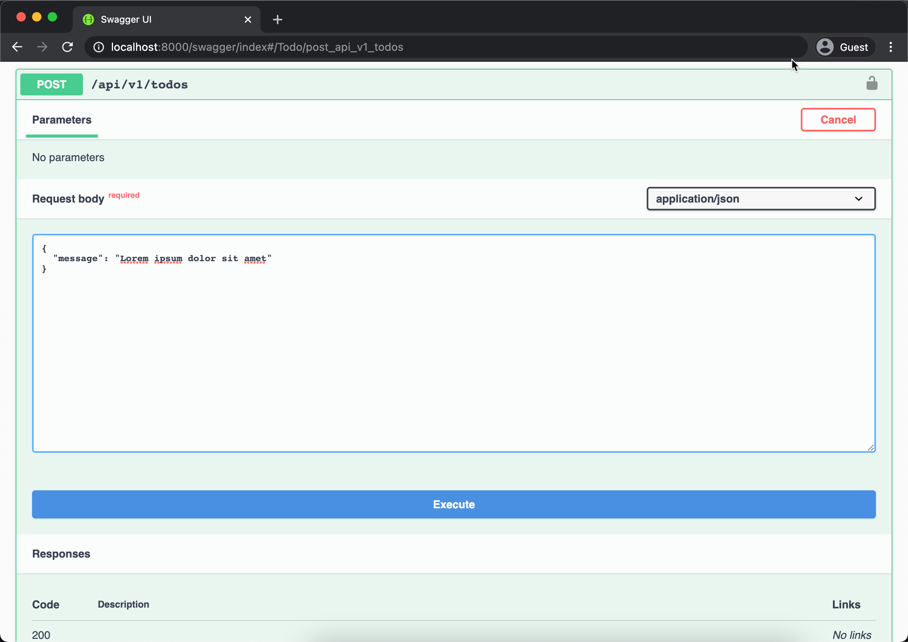

This tutorial will walk you through creating a Restful API managing a Todo data with MySQL database, first we will learn about how to create a Plumier project, then we will learn how to create CRUD API using generic controller then finally we add authorization to protect the data.

## Software Requirements 

To be able to follow this example you need some software installed in your computer.
* [Node.js](https://nodejs.org/en/) v10 or newer 
* Any terminal app
* Any text editor, in this example using VSCode
* MySQL database 

## Init Project

To get started we need to download [TypeORM Rest API project starters](https://github.com/plumier/starters/tree/master/rest-api-typeorm) from GitHub repository. In this example we will use [Degit](https://www.npmjs.com/package/degit) to download it. 

Execute commands below in your terminal to download the project starter

```sh
npx degit plumier/starters/rest-api-typeorm todo-api
``` 

Above command will download Degit locally then download Plumier TypeORM Rest API project starter into `todo-api` directory. 

:::info
If you having problem executing `npx` you can manually install Degit globally
```sh
npm i -g degit 
```

Then followed by executing Degit manually like below

```sh
degit plumier/starters/rest-api-typeorm todo-api
```
:::

Enter to the project directory by executing command below

```
cd todo-api
```

Install package dependencies by executing command below 

```sh
npm install
```

## Project Starter File Structure
Open the project directory using your favorite text editor or IDE, its recommended to use VSCode to easily follow this tutorial. 


Project starter shipped with a user management and security functionality setup to secure the API. Spent some time to read the `user-and-security.md` doc to get understanding on how the user management and security setup works.

Project starter separate files per resource under `src/api` directory, each file must follow the naming convention.

* File ends with `-controller.ts` contains codes for controller.
* File ends with `-entity.ts` contains entities or first class entity.
* File ends with `-policy.ts` contains authorization policy logic.

All file stays in `_shared` directory intended to be shared among the sibling directories.

You can change those behavior on Plumier application bootstrap on `app.ts` file. 

## Running The Project

After all dependencies installed then it should be good to go, but before we start codding we need to provide required environment variable to make the project work correctly.

Rename the `.env-example` file into `.env` file, then execute command below to run the project

```
npm run debug
```

If you are follow step above correctly then above code will print message indicating it serve CRUD user API like below 

```
> rest-api-typeorm@1.0.0 debug todo-api
> ts-node-dev --inspect -- src/index

[INFO] 04:38:03 ts-node-dev ver. 1.1.1 (using ts-node ver. 9.1.1, typescript ver. 4.1.3)
Debugger listening on ws://127.0.0.1:9229/d91c5d70-332a-4880-bf63-aa3c880115b6
For help, see: https://nodejs.org/en/docs/inspector

Route Analysis Report
1. AuthController.login(email, password)    -> Public        POST   /auth/login
2. AuthController.refresh(user)             -> RefreshToken  POST   /auth/refresh
3. AuthController.logout()                  -> Private       GET    /auth/logout
4. TypeORMControllerGeneric.list            -> Admin         GET    /users
5. TypeORMControllerGeneric.save(data, ctx) -> Public        POST   /users
6. TypeORMControllerGeneric.get             -> ResourceOwner GET    /users/:id
7. TypeORMControllerGeneric.modify          -> ResourceOwner PATCH  /users/:id
8. TypeORMControllerGeneric.replace         -> ResourceOwner PUT    /users/:id
9. TypeORMControllerGeneric.delete(id, ctx) -> ResourceOwner DELETE /users/:id
```

Above is the route analysis report created by Plumier route generator system, it prints generated routes from controllers and generic controllers during the generation process, it may print issues on each route if occur.

If you see above routes, there are two resources currently hosted that is `/auth` and `/users`. Auth resource used to handle authentication its put on the `api/auth/auth-controller.ts` file. Its handled by a common controller, on the left of the route analysis report you can see the action handles the route `AuthController.login(email, password)`. 

The User resource is quite different, you can see the source code in `api/users/user-entity.ts` it uses first class entity with `@genericController()` decorator which means its handled by a generic controller. You can see also on the left of the route analysis report the action handled the routes uses `TypeORMControllerGeneric`.

## Setup MySQL Connection

By default project starter uses SQLite database driver, in this example we will install MySQL database and change the appropriate connection string on the `.env` file. Execute command below on your terminal app.

```
npm install --save mysql 
```

Above will install mysql driver and modify the `package.json` file, you may uninstall the `sqlite3` driver by removing it on the `package.json` file, but its not necessary need to do on this example.

Create MySQL database named `todo` with any MySQL client and change the TypeORM configuration section on `.env` like below 

```
# TypeORM configurations
TYPEORM_URL = "mysql://<username>:<password>@localhost/todo"
TYPEORM_ENTITIES = "src/api/**/*-*(entity|controller).*(ts|js)"
TYPEORM_SYNCHRONIZE = true
TYPEORM_LOGGING = false
```

Restart the API which previously running by pressing `ctl+c` on the terminal app then re-run the command below to restart it.

```
npm run debug
```

## Add Root Path 

On this step we will add API version by adding root path `/api/v1` for all generated routes. To do that we will need to configure the Plumier application bootstrap.

Open the `src/app.ts` file and locate the `WebApiFacility` add configuration `rootPath: "/api/v1"` on the parameter, so the code will be like below. 

```typescript {3}
.set(new WebApiFacility({ rootPath: "/api/v1" }))
```

Save the file and see the log on terminal app will show our change like below.

```
Route Analysis Report
1. AuthController.login(email, password)    -> Public        POST   /api/v1/auth/login
2. AuthController.refresh(user)             -> RefreshToken  POST   /api/v1/auth/refresh
3. AuthController.logout()                  -> Private       GET    /api/v1/auth/logout
4. TypeORMControllerGeneric.list            -> Admin         GET    /api/v1/users
5. TypeORMControllerGeneric.save(data, ctx) -> Public        POST   /api/v1/users
6. TypeORMControllerGeneric.get             -> ResourceOwner GET    /api/v1/users/:id
7. TypeORMControllerGeneric.modify          -> ResourceOwner PATCH  /api/v1/users/:id
8. TypeORMControllerGeneric.replace         -> ResourceOwner PUT    /api/v1/users/:id
9. TypeORMControllerGeneric.delete(id, ctx) -> ResourceOwner DELETE /api/v1/users/:id
```

Above showing that now all the routes path started with `/api/v1` with all the routes generated.

## Testing API Using Swagger

The project starter comes with swagger ui under `http://localhost:8000/swagger` we can use it to test the User API provided by the project starter. 

Navigate to the `POST /api/v1/users` and provide the email, name and password like below


Above process will return the ID of the inserted record `{ id: 1 }`. Next we can try the login function by navigating to the `POST /auth/login` endpoint and provide email and password that we entered previously. 


Above will returned two JWT tokens `{ token, refreshToken }` and also writes the Authorization cookie to the browser. Now you are login to the system, try play around accessing private resource such as `GET /api/v1/users/{id}` like below. 


## Add Todo API 

Now we're ready for codding, we will add Todo resource to the application using a generic controller. Create new directory under `/src/api` named `todo` and create new file named `todo-entity.ts` and copy paste code below. 

```typescript 
import { authorize, bind, preSave, route, val } from "plumier"
import { BaseEntity, Column, Entity, ManyToOne } from "typeorm"

import { LoginUser } from "../_shared/login-user"
import { User } from "../user/user-entity"

@genericController(c => {
    c.methods("Put", "Patch", "Delete").authorize("ResourceOwner", "Admin")
})
@Entity()
export class Todo extends BaseEntity {
    @val.required()
    @Column()
    message: string

    @Column({ default: false })
    completed: boolean

    @authorize.readonly()
    @ManyToOne(x => User)
    user: User

    @preSave("post")
    setUser(@bind.user() user: LoginUser) {
        this.user = <User>{ id: user.userId }
    }
}
```

If you are a TypeORM user you may a bit familiar with above code. Above is a first class entity, its control most API behavior from the entity itself. 

`@genericController()` will inform Plumier that this entity handled by a generic controller. Provide simple configuration to set that the Todo data only can be modified (`PUT`, `PATCH`, `DELETE`) by the `ResourceOwner` (user created the todo) and by the `Admin` of the API. 

We apply validation on the `message` property, tells Plumier that this field is required. Plumier will automatically response 422 when this field value does not provided.

We add `@authorize.readonly()` on the `user` property because its value automatically populated using `preSave` request hook. 

On `preSave` request hook we bind the current login user into the `user` parameter and populate the `user` property value. This `setUser` method will be executed before the entity saved into the database. Note that the `post` parameter provided means this method only executed on POST method, other than that it will never executed.

Save the file and see if the route analysis report showing result like below.

```
..... other routes ....
4. TypeORMControllerGeneric.list            -> Private             GET    /api/v1/todos
5. TypeORMControllerGeneric.save(data, ctx) -> Private             POST   /api/v1/todos
6. TypeORMControllerGeneric.get             -> Private             GET    /api/v1/todos/:id
7. TypeORMControllerGeneric.modify          -> ResourceOwner|Admin PATCH  /api/v1/todos/:id
8. TypeORMControllerGeneric.replace         -> ResourceOwner|Admin PUT    /api/v1/todos/:id
9. TypeORMControllerGeneric.delete(id, ctx) -> ResourceOwner|Admin DELETE /api/v1/todos/:id
..... other routes ....
```

Now we ready to test our Todo API, go back to swagger ui and find out the `POST /api/v1/todos` endpoint and execute with data like below.



Above will return the new inserted record ID `{ id: 1 }` indicate that our API already work properly. You can play around with other API such as `GET /api/v1/todos/{id}` like below. 


Like you see above the `user` property of the Todo entity populated properly with the current login user. Next step we will secure our API so it only can be modify and deleted by the owner of the Todo.

## Todo ResourceOwner Definition

If you look at the `/api/user/user-policy.ts` file you will see how the `ResourceOwner` auth policy defined using `entityPolicy`. Entity policy works only to specific entity defined, its logical since definition of `ResourceOwner` may vary among entity based on the data structure. In this step will will created definition for `ResourceOwner` specifically for Todo entity. 

Create a new file under `/api/todo` named `todo-policy.ts` and copy paste code below. 

```typescript
import { entityPolicy } from "plumier"
import { getManager } from "typeorm"

import { Todo } from "./todo-entity"

entityPolicy(Todo)
    .register("ResourceOwner", async (ctx, id) => {
        const repo = getManager().getRepository(Todo)
        const todo = await repo.findOne(id, { relations: ["user"], cache: true })
        return ctx.user?.userId === todo?.user?.id
    })
```

Above is the definition of `ResourceOwner` for Todo and provide a callback function how we define the owner of the Todo data like this `ctx.user.userId === todo.user.id`. This callback function will be called several time: 

* During route authorization evaluation, to check if user authorized to access the route.
* During parameter authorization evaluation, to check if user authorized to set entity property.
* During response authorization evaluation, to remove some property that not authorized to a user.

Based on above behavior, its necessary to cache the query to speed up the process. 

The callback received two parameters the first is the Authorization Context and the second is the ID of the evaluated Todo data. The callback returned `true` to authorized the user other wise `false`. 

Now its time to test our auth policy, create another user using `POST /api/v1/users` API then login using `POST /api/v1/login`. Then try to delete our last inserted todo using the `DELETE /api/v1/todos/{id}` like below. 


Picture above showing that our auth policy successfully secured the API by returning 401. 

## Nested API for Todo Comment

We are successfully created an API using a generic controller, next we will learn how to create nested API using nested generic controller. 

Nested API is a restful best practice to provide parent - children API, usually used nested endpoint like `/parents/{parentId}/children`. 

In this example we will form Todo -> Comment as a parent - children relation, since each Todo can have their own notes. We will provide an API using nested generic controller to do that. 

First we need to define the Comment entity, create a directory under `src/api` named `todo-comment`, then create a file named `comment-entity.ts` then copy paste code below. 

```typescript
import { authorize, bind, preSave, route, val } from "plumier"
import { Column, Entity, ManyToOne } from "typeorm"

import { EntityBase } from "../_shared/entity-base"
import { LoginUser } from "../_shared/login-user"
import { Todo } from "../todo/todo-entity"
import { User } from "../user/user-entity"

@Entity()
export class Comment extends EntityBase {
    @val.required()
    @Column()
    message: string

    @authorize.readonly()
    @ManyToOne(x => User)
    user: User

    @authorize.readonly()
    @ManyToOne(x => Todo)
    todo: Todo

    @preSave("post")
    setUser(@bind.user() user: LoginUser) {
        this.user = <User>{ id: user.userId }
    }
}
```

Above is the Comment entity, the `todo` entity set to readonly, since its a reverse property to the parent entity it will populated automatically by the generic controller.

You may notice that it doesn't have `@genericController()` decorator. The most important thing is, nested generic controller require an array relation (one to many or many to many) than we can create the API by providing `@genericController()` on the relation property. 

```typescript 
import { Column, Entity, ManyToOne, OneToMany } from "typeorm"

import { Comment } from "../todo-comment/comment-entity"
/** other imports **/

export class Todo extends EntityBase {

    /** other properties **/

    @genericController(c => {
        c.methods("Put", "Patch", "Delete").authorize("ResourceOwner", "Admin")
    })
    @OneToMany(x => Comment, x => x.todo)
    comments: Comment[]
}
```

Above showing that we modify our current Todo entity by adding a one to many relation to the comment entity. You can see also we add `@genericController()` decorator above the `comments` property means its will be handled by a nested generic controller.

:::info
Decorating property with `@genericController()` may make the code less cleaner, since the controller configuration stays in `todo` directory instead of the `todo-comment` directory. Alternatively you can put `@genericController()` above the Comment entity with `useNested` configuration like below.

```typescript {2}
@genericController(c => {
    c.useNested(Todo, "comments")
    c.methods("Put", "Patch", "Delete").authorize("ResourceOwner", "Admin")
})
@Entity()
export class Comment extends EntityBase { }
```
:::

Next you can save the file and see the route analysis report like below. 

```
..... other routes ....
10. TypeORMOneToMany...eneric.list           -> Private             GET    /api/v1/todos/:pid/comments
11. TypeORMOneToMany...eneric.save           -> Private             POST   /api/v1/todos/:pid/comments
12. TypeORMOneToMany...eneric.get            -> Private             GET    /api/v1/todos/:pid/comments/:id
13. TypeORMOneToMany...eneric.modify         -> ResourceOwner|Admin PATCH  /api/v1/todos/:pid/comments/:id
14. TypeORMOneToMany...eneric.replace        -> ResourceOwner|Admin PUT    /api/v1/todos/:pid/comments/:id
15. TypeORMOneToMany...eneric.delete         -> ResourceOwner|Admin DELETE /api/v1/todos/:pid/comments/:id
..... other routes ....
```

You see that the routes now handled by `TypeORMOneToManyControllerGeneric` and the endpoints is `/api/v1/todos/:pid/comments`. We used the Todo Comment API endpoints by providing the Todo ID like this `/api/v1/todos/1/comments`. 

We can test our new API using swagger like the picture below. 


When successfully added a comment, try adding more comments to the Todo and then show all the inserted comments using `GET /api/v1/todos/1/comments` like picture below.


Try experimenting with filter and select parameter and see the change reflected in the response result. 

## Comment Resource Owner

The last step, we need to define `ResourceOwner` for the Comment entity, the step is exactly the same like before. Create a new file named `comment-policy.ts` then copy paste code below. 

```typescript
import { entityPolicy } from "plumier"
import { getManager } from "typeorm"

import { Comment } from "./comment-entity"

entityPolicy(Comment)
    .register("ResourceOwner", async (ctx, id) => {
        const repo = getManager().getRepository(Comment)
        const comment = await repo.findOne(id, { relations: ["user"], cache: true })
        return ctx.user?.userId === comment?.user?.id
    })
```

Code above is mostly the same as before. We can test our auth policy by using other user to delete the comment like picture below.


Above showing that other user failed to delete the comment by returned 401. You can play around with other API and see how the its reflect in the response. 

Thats it! this is the end of the get started tutorial, don't forget that Plumier has more feature for you to explore.