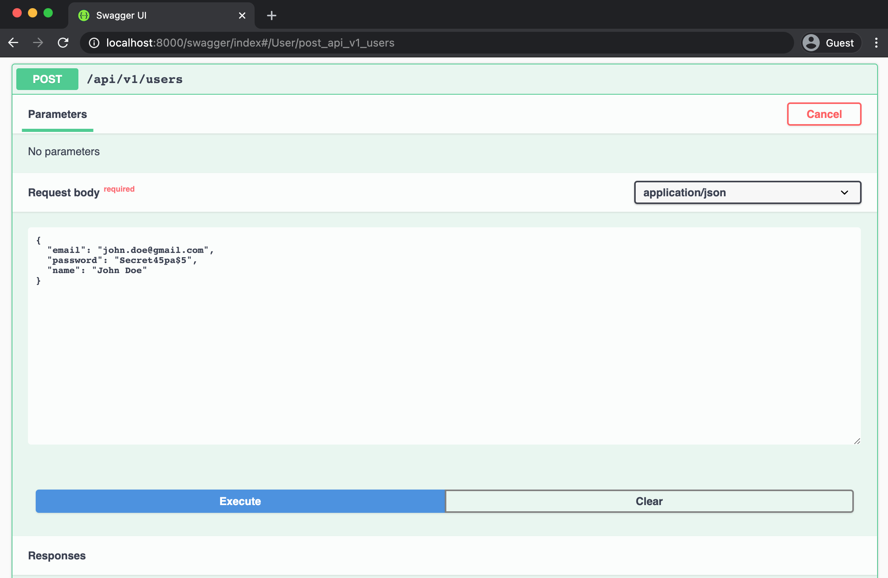
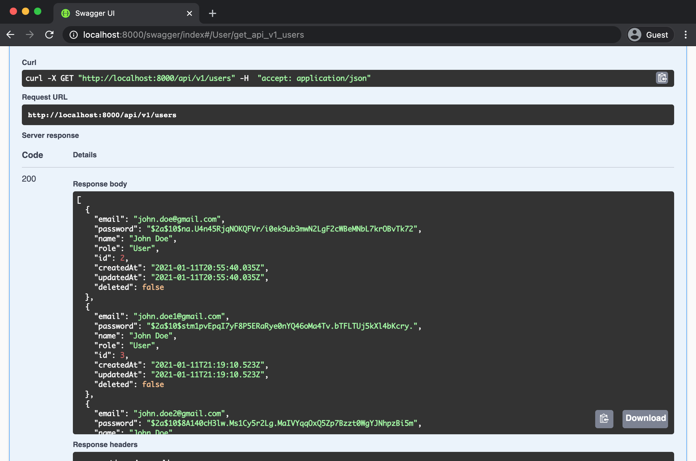
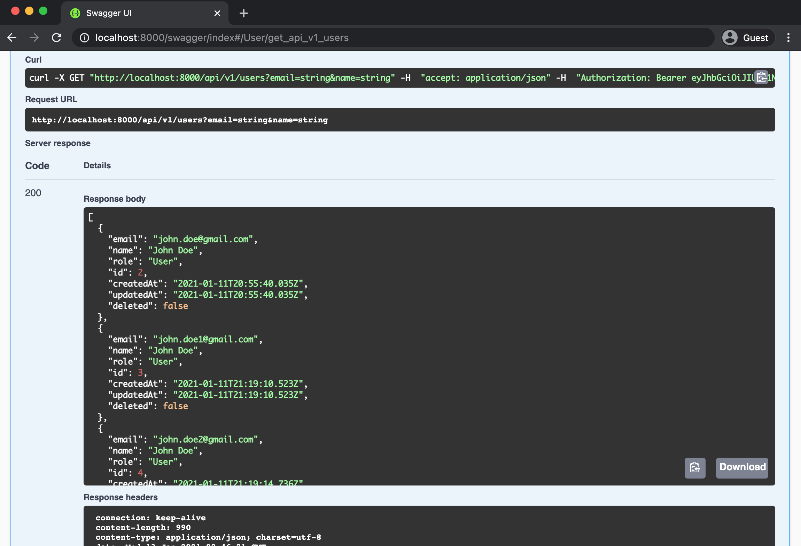
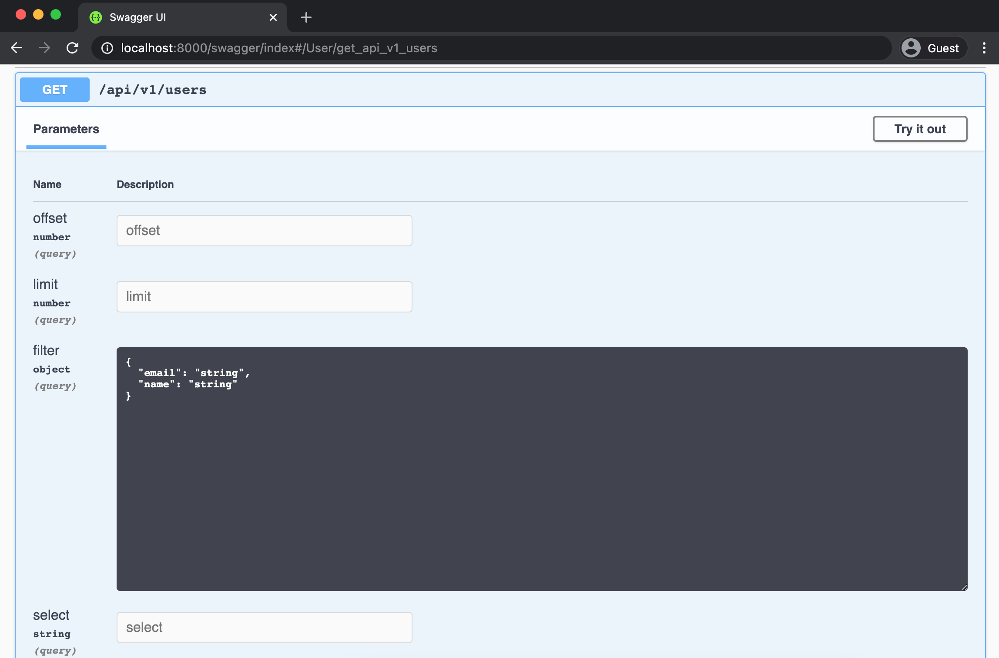

In this section we will learn how to create API using generic controller, the step is quite simple, first we create a TypeORM entity to define the structure of the data then decorate then map them into API handled by generic controller.

## Setup MySQL Connection

By default project starter comes with SQLite database driver, in this example we will install MySQL database and change the appropriate connection string on the `.env` file. Execute command below on your terminal app.

```
npm install --save mysql 
```

Create MySQL database named `todo` and change environment file `.env` configuration like below 

```
PORT=8000

# jwt secret key
PLUM_JWT_SECRET=your jwt secret here

# TypeORM configurations
TYPEORM_URL = "mysql://<username>:<password>@localhost/todo"
TYPEORM_ENTITIES = "src/api/**/*-*(entity|controller).*(ts|js)"
TYPEORM_SYNCHRONIZE = true
TYPEORM_LOGGING = true
```

Restart the API which previously running by pressing `ctl+c` on the terminal app then re-run the command below to restart it.

```
npm run debug
```

Using command above, confirm that TypeORM log showing User table has been created, or you can check if the table created using your MySQL client app. 

## Add Root Path 

If you remember our project description we will create APIs under `/api/v1` path, we can specify that on the Plumier application on `src/app.ts`. 

Open the `src/app.ts` file and locate the `ControllerFacility` add another configuration `rootPath: "/api/v1"` on the parameter, so the code will be like below. 

```typescript {3}
.set(new ControllerFacility({ 
    controller: "./api/**/*-*(entity|controller).*(ts|js)",
    rootPath: "/api/v1"
}))
```

Save the file and see the log on terminal app will show our change like below.

```
Route Analysis Report
1. TypeORMControllerGeneric.list            -> Public GET    /api/v1/users
2. TypeORMControllerGeneric.save(data, ctx) -> Public POST   /api/v1/users
3. TypeORMControllerGeneric.get             -> Public GET    /api/v1/users/:id
4. TypeORMControllerGeneric.modify          -> Public PATCH  /api/v1/users/:id
5. TypeORMControllerGeneric.replace         -> Public PUT    /api/v1/users/:id
6. TypeORMControllerGeneric.delete(id, ctx) -> Public DELETE /api/v1/users/:id
```

Above showing that now all the routes path started with `/api/v1`. 

## Modify User Entity

Project starter already provide User entity on `src/api/user/user-entity.ts`. Its just a common TypeORM entity but decorated with `@route.controller()` which inform Plumier that this entity will be handled by a generic controller. 

Locate the user entity and copy paste code below 

```typescript
import bcrypt from "bcryptjs"
import { preSave, route, val } from "plumier"
import { Column, Entity } from "typeorm"

import { EntityBase } from "../_shared/entity-base"

@route.controller(c => c.all().authorize("Public"))
@Entity()
export class User extends EntityBase {
    @val.required()
    @val.unique()
    @val.email()
    @Column()
    email: string

    @val.required()
    @Column()
    password: string

    @val.required()
    @Column()
    name: string

    @Column({ default: "User" })
    role: "User" | "Admin"

    @preSave()
    async hashPassword() {
        if (this.password)
            this.password = await bcrypt.hash(this.password, await bcrypt.genSalt())
    }
}
```

Above code showing that we add more columns on user entity, we also add some validation decorator above the properties. 

At the top most we add `c.all().authorize("Public")` on the controller configuration which mean all the routes will be accessible by Public. For now just keep it like that so we will be able to test the User API.

:::info 
`"Public"` is a predefined authorization policy which make route/property accessible by public
:::

We also define `role` property to save user role which has default value `User`. We will learn about role more on the next section on securing the API with Authorization. 

We add a simple logic to hash the password using bcrypt on the `hashPassword()` method, this method uses `@preSave()` decorator which mean the method ran before the entity saved to the database. PreSave hook works like TypeORM (BeforeInsert)(https://typeorm.io/#/listeners-and-subscribers/beforeinsert) except PreSave hook may has parameter that bound with request such as `@bind.user()` which is useful to get current user information from the method. 

Note that the `hasPassword` method may executed on `POST`, `PUT`, `PATCH` method, which `PATCH` method allow user to provide only partial user data, which the `password` field can be empty, thats why we use condition `if(this.password)` to make sure this code works properly on `PATCH` method.

That's it, the User API now its ready, next we will test it using http client, you can use any http client such as PostMan, HTTPie etc, in this tutorial we will only use CURL.

## Testing API with Swagger

The user API is ready, its time to test them. First we will test to create user using `POST /api/v1/users`. 

The project starter comes with swagger ui under `http://localhost:8000/swagger` we can use it to test the User API. 

Navigate to the `POST /api/v1/users` and provide the email, name and password like below



Above process will return the ID of the inserted record. Repeat process above to insert more data, so we will have some records on the database. 

Next navigate to the `GET /api/v1/users` API, execute it without parameters, the result will be like below 



Above we can see that our user API has been working correctly. It has properties that is defined on `EntityBase` correctly such as `id`, `createdAt`, `updatedAt`, `deleted`. 

Next you can try test to provide parameter on the swagger UI such as `limit`, `offset` etc and see how its affect the result respectively. 

## Hide Sensitive Fields

You may notice when getting list of users the `password` field visible on the JSON response. Its an unexpected result, but it's behave correctly because we didn't apply any security on the field. 

Hiding property in Plumier is quite easy, since password property behavior is `writeonly` we can configure it appropriately. Plumier provided `@authorize.writeonly()` decorator for that. Put that above the `password` property like code below.

```typescript {1,8}
import { authorize, preSave, route, val } from "plumier"
/** other imports **/

export class User extends EntityBase {

    /** other properties **/

    @authorize.writeonly()
    @val.required()
    @Column()
    password: string

    /** other properties **/
}

```

Go back to the swagger ui then re try to get the response of the `GET /api/v1/users` API, you will see that now the `password` field is not visible any more like below.



Above picture showing that `password` filed already hidden from response, you may still showing `email` and `role` which relatively sensitive with some user, we will secure them later after we setup authorization on the next section. 

## Enable Filter

Generic controller has feature to filter the response result. By default this features is disabled, you need to define which field is filterable.

In this tutorial we will enable filter for `email` and `name` field. Navigate to `user-entity.ts` file and add `@authorize.filter()` on the `email` and `name` field like below. 

```typescript {2,11}
export class User extends EntityBase {
    @authorize.filter()
    @val.required()
    @val.unique()
    @val.email()
    @Column()
    email: string

    /** other properties **/

    @authorize.filter()
    @val.required()
    @Column()
    name: string

    /** other properties **/
}
```

Go back to the swagger ui and expand the `GET /api/v1/users` api, you will see now the endpoint accepts `filter` parameter like below. 



## Todo Entity

We successfully modify User entity and map it into API properly, now we will add Todo entity do the same with User entity. 

Create a new directory under `src/api` directory named `todo` then create file named `todo-entity.ts`. Copy paste code below into the `todo-entity.ts` file.

```typescript
import { route, val } from "plumier"
import { Column, Entity, ManyToOne } from "typeorm"

import { EntityBase } from "../_shared/entity-base"
import { User } from "../user/user-entity"


@route.controller(c => c.all().authorize("Public"))
@Entity()
export class Todo extends EntityBase {
    @val.required()
    @Column()
    message: string

    @Column({ default: false })
    completed: boolean

    @ManyToOne(x => User)
    user: User
}
```

Save code above and locate the terminal, confirm if TypeORM log showing a table named `todo` created. 

Check also the Route Analysis Report that some new routes `/api/v1/todos` created like below.

```text {2-7}
Route Analysis Report
 1. TypeORMControllerGeneric.list            -> Public GET    /api/v1/todos
 2. TypeORMControllerGeneric.save(data, ctx) -> Public POST   /api/v1/todos
 3. TypeORMControllerGeneric.get             -> Public GET    /api/v1/todos/:id
 4. TypeORMControllerGeneric.modify          -> Public PATCH  /api/v1/todos/:id
 5. TypeORMControllerGeneric.replace         -> Public PUT    /api/v1/todos/:id
 6. TypeORMControllerGeneric.delete(id, ctx) -> Public DELETE /api/v1/todos/:id
 7. TypeORMControllerGeneric.list            -> Public GET    /api/v1/users
 8. TypeORMControllerGeneric.save(data, ctx) -> Public POST   /api/v1/users
 9. TypeORMControllerGeneric.get             -> Public GET    /api/v1/users/:id
10. TypeORMControllerGeneric.modify          -> Public PATCH  /api/v1/users/:id
11. TypeORMControllerGeneric.replace         -> Public PUT    /api/v1/users/:id
12. TypeORMControllerGeneric.delete(id, ctx) -> Public DELETE /api/v1/users/:id
```

Go back to the swagger UI and try adding a todo data like picture below


Note that on picture above we provide `2` for user value which is a valid ID of a user. On the next section we will learn how to automatically populate this value with current login user using request hook. 

## Todo Comment Entity (Nested Restful API)

In this section we will create a nested restful API. We used nested API usually with parent - children relation data, which has form like this `/parents/{parentId}/children` to make the API more readable.

Since todo and comment is a parent children relation we can use nested restful api `/api/v1/todos/{todoId}/comments`. To do that first we will create Comment entity first then setup one to many relation using TypeORM configuration. 

Create a directory under `/src/api` named `todo-comment` and add a file named `comment-entity.ts` and copy paste code below 

```typescript
import { authorize, val } from "plumier"
import { Column, Entity, ManyToOne } from "typeorm"

import { EntityBase } from "../_shared/entity-base"
import { Todo } from "../todo/todo-entity"
import { User } from "../user/user-entity"

@Entity()
export class Comment extends EntityBase {
    @val.required()
    @Column()
    message: string

    @ManyToOne(x => User)
    user: User

    @authorize.readonly() 
    @ManyToOne(x => Todo)
    todo: Todo 
}
```

Above is the comment entity, we don't specify route mapping for it because the mapping will be on the relation part. 

`todo` property is the reverse relation to its parent (Todo entity), we set it as readonly since on nested API using generic controller the reverse relation (parent id) automatically set by the controller. 

Next we will modify the Todo entity by adding one to many relation to Comment entity by adding `comments` property. 

```typescript {8}
import { Comment } from "../todo-comment/comment-entity"
/** other imports **/

export class Todo extends EntityBase {

    /** other properties **/

    @route.controller(c => c.all().authorize("Public"))
    @OneToMany(x => Comment, x => x.todo)
    comments: Comment[]
}
```

Note that on above code we setup the API mapping on the relation, by using this setting Plumier will create a nested generic controller handles `/todos/:pid/comments`. 

Save the files and see the Route Analysis Report on the terminal, make sure you see some new nested routes like below. 

```text {8-13}
Route Analysis Report
 1. TypeORMControllerGeneric.list            -> Public GET    /api/v1/todos
 2. TypeORMControllerGeneric.save(data, ctx) -> Public POST   /api/v1/todos
 3. TypeORMControllerGeneric.get             -> Public GET    /api/v1/todos/:id
 4. TypeORMControllerGeneric.modify          -> Public PATCH  /api/v1/todos/:id
 5. TypeORMControllerGeneric.replace         -> Public PUT    /api/v1/todos/:id
 6. TypeORMControllerGeneric.delete(id, ctx) -> Public DELETE /api/v1/todos/:id
 7. TypeORMOneToMany...eneric.list           -> Public GET    /api/v1/todos/:pid/comments
 8. TypeORMOneToMany...eneric.save           -> Public POST   /api/v1/todos/:pid/comments
 9. TypeORMOneToMany...eneric.get            -> Public GET    /api/v1/todos/:pid/comments/:id
10. TypeORMOneToMany...eneric.modify         -> Public PATCH  /api/v1/todos/:pid/comments/:id
11. TypeORMOneToMany...eneric.replace        -> Public PUT    /api/v1/todos/:pid/comments/:id
12. TypeORMOneToMany...eneric.delete         -> Public DELETE /api/v1/todos/:pid/comments/:id
13. TypeORMControllerGeneric.list            -> Public GET    /api/v1/users
14. TypeORMControllerGeneric.save(data, ctx) -> Public POST   /api/v1/users
15. TypeORMControllerGeneric.get             -> Public GET    /api/v1/users/:id
16. TypeORMControllerGeneric.modify          -> Public PATCH  /api/v1/users/:id
17. TypeORMControllerGeneric.replace         -> Public PUT    /api/v1/users/:id
18. TypeORMControllerGeneric.delete(id, ctx) -> Public DELETE /api/v1/users/:id
```

Now we ready to test the Todo Comment API. Go back to swagger UI add a comment like below. 

