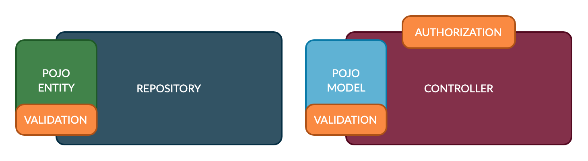
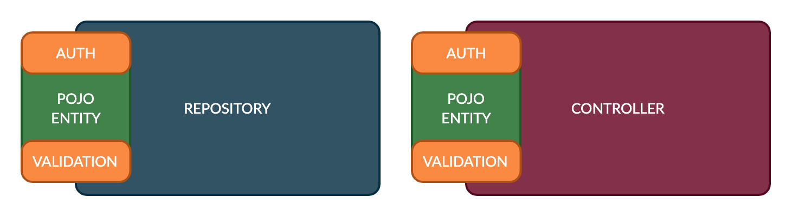
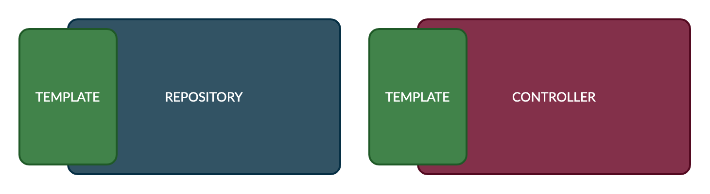

Some modern frameworks usually consist of some components like Entity (ORM Entity), Repository, Model, Service, Controller. Picture below showing the simplest pattern commonly used, the repository pattern.



Repository pattern consist of a POJO (Plain Old JavaScript Object) Entity represent the schema of a database table and used by ORM to map entity with the table. POJO entity may contains validation decorators about data type and its size. 

Repository is the action of the data layer, it has control to save the data represented by the entity into the database. Usually a repository contains a general CRUD operation which mostly the same among different entities, thus some library provide a reusable generic repository out of the box. 

POJO model represent the request/response schema. POJO model may contains decorators to validate API consumer request. In most case the schema of POJO entity and POJO model may the same, it shares the same properties with the same data type, except some relation properties that appears on POJO entity will not appears in POJO model.

Controller is the action of the application layer, it has control to the request and response and perform data access using repository. Controller may contains decorators to authorize API consumer to restrict access to the data. 

## Entity as The First Class Citizen 

In most CRUD operation, Repository and Controller may perform the same steps over and over, for example Repository and Controller for CRUD User or CRUD Items mostly perform the same steps, the components that is vary is the Entity, Model, Validation and Authorization. 

With proper separation of validation and authorization we can move the Authorization into the entity and replace the POJO model with POJO entity like picture below which make controller and repository shared the same entity. 



Above modification we give Entity more control in the system (a first class citizen). 
1. It defines table schema 
2. It defines who will do validation and authorization 
3. It defines request/response schema.

## Benefit

By treating entity as a first class citizen we will able to review data schema dan security easily from single location. As a bonus, while Entity now controls everything, its now possible to create a generic controller that is reusable among CRUD operations. 



Since authorization and validation stays on Entity using decorators, we can create several CRUD APIs using generic controller above only based on Entities. Furthermore we can use decorator on entity and create generic controller dynamically on the fly to automatically create CRUD endpoints magically from entities.

## Problems and Solutions

Using POJO entity as representation of request/response that usually tasked to POJO model may lead to some issue Plumier provided some features to support the First Class Entity

### Data Security  
ORM entity usually contains properties that holds sensitive data such as password, date of birth etc, which will introduce security issue when ORM entity used as DTO. 

Plumier provided authorization in property basis, which make it possible to restrict read/write access to property. 

```typescript {6,11}
class User {
    id: number

    email: string

    @authorize.writeonly()
    password: string

    name: string

    @authorize.write("SuperAdmin", "Admin")
    role: "SuperAdmin" | "Admin" | "User"
}
```

Using above code, when used as request body model, will only allow `SuperAdmin` and `Admin` to set the `role` property. And when used as response body model will prevent `password` being visible to any user. 

### Entity Relation
ORM entity may contains relation properties to represent join with another tables, usually relation properties defined with data type of the related table instead of the ID data type. 

```typescript {15}
class User {
    @PrimaryGeneratedColumn()
    id: int

    /** other properties **/
}

class Log {
    @PrimaryGeneratedColumn()
    id: int

    /** other properties **/

    @ManyToOne(x => User)
    user: User 
}
```

`Log.user` data type is `User` but when inserting value usually we will use `number` instead of `User` object. 

When used as request body model, framework Type Converter need to understand that the `Log.user` property should be filled with data of type `number` instead of the `User` object. Open API Schema generator also should be showing proper data type for `Log.user` property instead of showing `User` object schema. 

### Disable Required Validation 
When used as POJO model, entity may decorated with `@val.required()` decorator. This `required` behavior will become issue when entity used to handled `PATCH` methods, since `PATCH` methods allow omitting other properties that will not changed.

```typescript 
class User {
    id: number

    @val.required()
    email: string

    @val.required()
    password: string

    @val.required()
    name: string

    role: "SuperAdmin" | "Admin" | "User"
}
```

Above code showing that `email`, `password` and `name` are required. Since `PATCH` method allowed user to only set `email` or just the `password`, its impossible to use `User` entity as DTO of patch model. 

Plumier uses `@val.partial(User)` to skip all of the required validation thus make it possible to use as model of `PATCH` method. 

```typescript
class UsersController {
    @route.patch(":id")
    modify(id:number, @val.partial(User) user:User){ }
}
```

### Complex Default Values 

Its a common case when adding a new record also required extra setup before and after saving the record. For example when adding a User records its required to hash the password before its saved to database. 

Plumier provided request hook to process during saving process. There are `@preSave()` and `@postSave()` hook that will executed before or after the entity saved to database. Request hook supported parameter binding to easily get request part.

```typescript 
import { preSave } from "plumier"
import { getSalt, hash } from "bcryptjs"

@Entity()
class User {
    
    /** other properties **/

    // this method called before entity saved to db
    @preSave()
    hashPassword(){
        const salt = await genSalt()
        this.password = await hash(this.password, salt)
    }
}
```

### Inheritable Controller 

When controller defined with generic controller, its required to inherit them to create the controller implementation. To get an inheritable behavior controller must define route based on controller and action, it cannot be defined using absolute route. 

```typescript 
class ControllerBase<T> {

    @route.post("")
    save(data:T){ }

    @route.get(":id")
    get(id:number) { }
}

class AnimalsController extends ControllerBase<Animal> {}
```

Above code will generated into two routes `POST /animals` and `GET /animals/:id`. Like you see the `animals` comes from the derived class controller `AnimalsController` while the Http Method and the trailing path defined by base class. 

### Configurable Controller from Class Scope

When controller inherited from a base class controller, its mostly difficult to configure base class action from derived class like example below

```typescript 
class ControllerBase<T> {

    @route.post("")
    save(data:T){ }

    @route.get(":id")
    get(id:number) { }
}

class AnimalsController extends ControllerBase<Animal> {}
```

To change authorization access of `save` method `AnimalsController` needs to override the method and put `@authorize.role()` manually like below.


```typescript 
class AnimalsController extends ControllerBase<Animal> {

    @authorize.role("Admin")
    save(data:T){ 
        return super.save(data)
    }
}
```

We unable to do that when the inherited class created dynamically on the fly, thus its required configuration from the class scope like below. 

```typescript 
@authorize.role("Admin", { applyTo: "save" })
class AnimalsController extends ControllerBase<Animal> { }
```

The `applyTo` configuration supported by the reflection library out of the box, It tells reflection library to move the decorator into specific class member specified. 

### Projection, Filter and Order

When retrieving data from server using the API, API consumer may need to get the data in some order, or sometime need to exclude some result or exclude some properties returned. 

To fulfil that, we need to provide some query parameter on the `GET` method to be able for API consumer to refine the API response match their need, for example.

```
// result projection 
GET /animals?select=id,name,dateOfBirth

// order by dateOfBirth desc, name asc
GET /animals?order=-dateOfBirth,name

// filter by exact name
GET /animals?filter[name]=mimi
```
