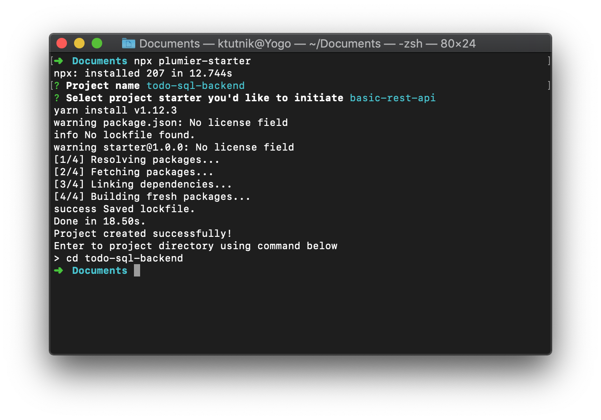
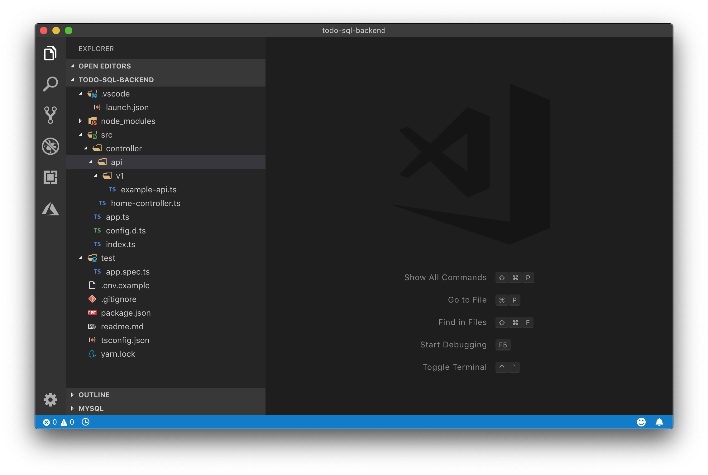
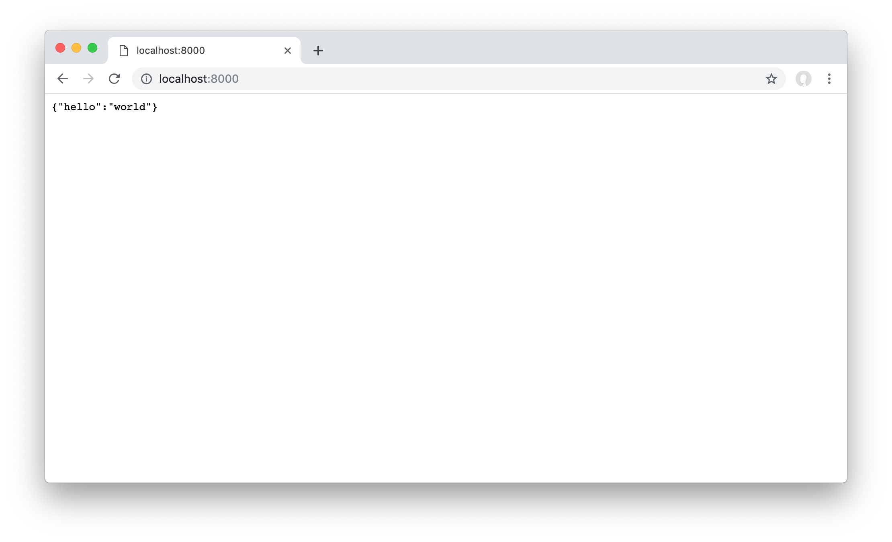

This tutorial will teaches about Plumier features and best practices on developing restful api. The example restful api will manage database of Todo. At the end of the tutorial you will learn how to: 
* Initiate basic rest api project with Plumier Starter
* Create restful api and connecting to SQL database
* Create local (username/password) authentication 
* Add validation and custom validation on user input
* Securing routes and parameters based on user role
* Build and deploying to Heroku


> This tutorial separated into 10 steps, each step explain specifically about Plumier feature
> * Step 01. Get started (this part) 
> * [Step 02. Create domain model](create-domain)  
> * [Step 03. Create database migration](create-migration)  
> * [Step 04. Create restful API](create-restful-api)  
> * [Step 05. Debugging](debugging)  
> * [Step 06. Create custom validation](create-custom-validation)  
> * [Step 07. Create local authentication](create-local-authentication)  
> * [Step 08. Securing routes](securing-routes)  
> * [Step 09. Securing domain models](securing-domain)  
> * [Step 10. Deployment to heroku](deployment)  
> 
> **Source Code**: 
> Complete source code of this tutorial can be found in [this repository](https://github.com/plumier/tutorial-todo-sql-backend)

## Requirement
To be able to follow this tutorial you will need software below installed in your machine.
* [Node.js](https://nodejs.org/en/download/) version 8 or newer version 
* [Visual Studio Code](https://code.visualstudio.com/download) 
* [HTTPie](https://httpie.org/#installation) 
* [Yarn](https://yarnpkg.com/lang/en/docs/install) 
  
> Yarn is required, Plumier Starter cli app use Yarn internally to initiate the starter project.

Test the following code in your terminal application (Terminal, Cmd, Powershell, Git Bash) to make sure everything installed properly.

```bash
$ node -v
$ npx -v
$ yarn -v
$ code -v
$ http --version
```

Make sure all commands above returns appropriate installed version.

For mac user make sure you can launch VSCode from terminal using `code .` command like explained [here](https://code.visualstudio.com/docs/setup/mac#_launching-from-the-command-line).

## Initiate Basic Starter
Plumier provided some project starters which already have basic setup of Plumier rest api. In this example we will use Plumier Starter cli package to initiate our project. 

Open your terminal application and enter command below to start initiate project

```bash
$ npx plumier-starter
```

Command above will download the Plumier Starter package from npm registry and execute its command immediately after finished download.

* Plumier Starter will ask for project name, enter `todo-sql-backend` and press enter.
* Next Plumier Starter will ask for what starter will you use. Select `basic-rest-api` using arrow key on your keyboard and enter to confirm your selection.

Wait a few seconds until Plumier Starter finish downloading the starter and install dependencies for you.



Enter to the created directory, and launch Visual Studio Code on that directory by using command below

```bash
$ cd todo-sql-backend
$ code .
```

Code above should open Visual Studio Code with some files setup like picture below.



If Visual Studio Code not opened you can manually open the directory from Visual Studio Code menu. 

## Run The Project
Lets run the project starter to see if its downloaded and installed properly. Open [Visual Studio Code integrated terminal](https://code.visualstudio.com/docs/editor/integrated-terminal) and enter command below to start the project

```bash
$ yarn start
```

Code above will host the starter project on port 8000, it will print route analysis report showing two routes generated like below

```bash
yarn run v1.12.3
warning package.json: No license field
$ ts-node-dev --inspect -- src/index
Using ts-node version 8.0.2, typescript version 3.3.3333
Debugger listening on ws://127.0.0.1:9229/742ac15a-8320-49c4-8b91-390bda03f3bc
For help, see: https://nodejs.org/en/docs/inspector

Route Analysis Report
1. ExamplesController.list() -> GET /api/v1/examples
2. HomeController.index()    -> GET /

Server running http://localhost:8000/
```

Open browser and navigate to http://localhost:8000/ you should see hello world message in JSON format like picture below


