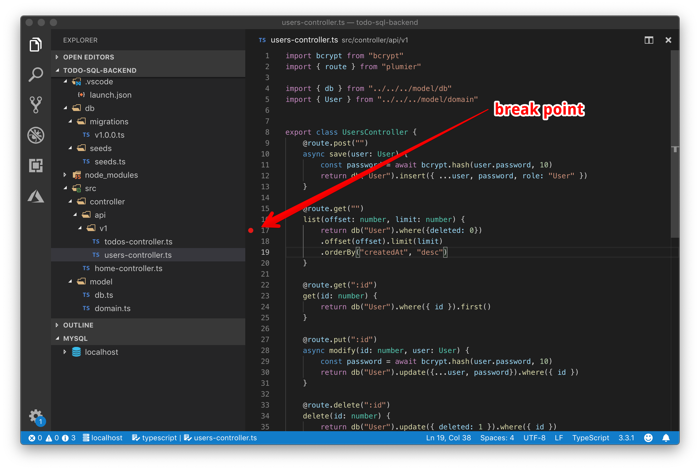
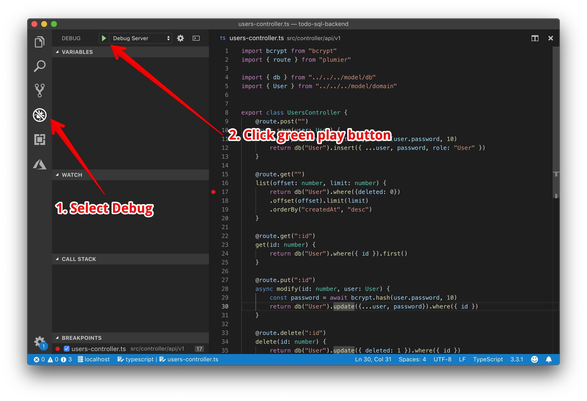
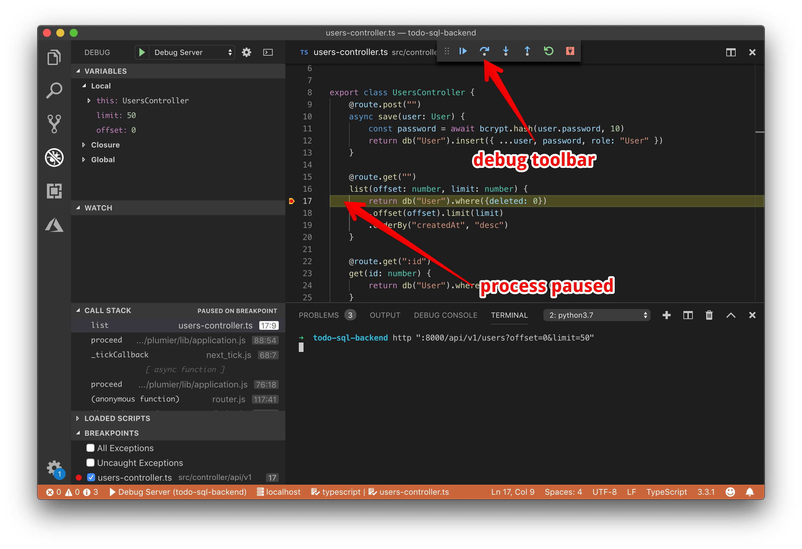

> **Info**  
> This is the fifth part of 10 steps tutorial on creating basic SQL restful API. Check navigation to navigate to other steps.


Project starter provided Visual Studio Code launch configuration for debugging the project. In this section we will try to debug the `GET :8000/api/v1/users?offset=0&limit=50` route.

## Add Breakpoint

Navigate to `users-controller.ts` file and put breakpoint inside `list` method like picture below:



Breakpoint above will instruct Visual Studio Code to pause the process on that line when the request happening. 


## Attach Debugger
Before start debugging, make sure the project already started using `yarn start` command. Run Visual Studio Code integrated debugger by selecting `Debug Server` like picture below




## Execute Request
Debugger is ready, now execute command below from Visual Studio integrated terminal to trigger the request

```bash
$ http ":8000/api/v1/users?offset=0&limit=50"
```

By using command above the process will be paused on the break point that we set like picture below:



Experiment with step over, step in and step out on the debug toolbar. Click disconnect button to stop debugging. 