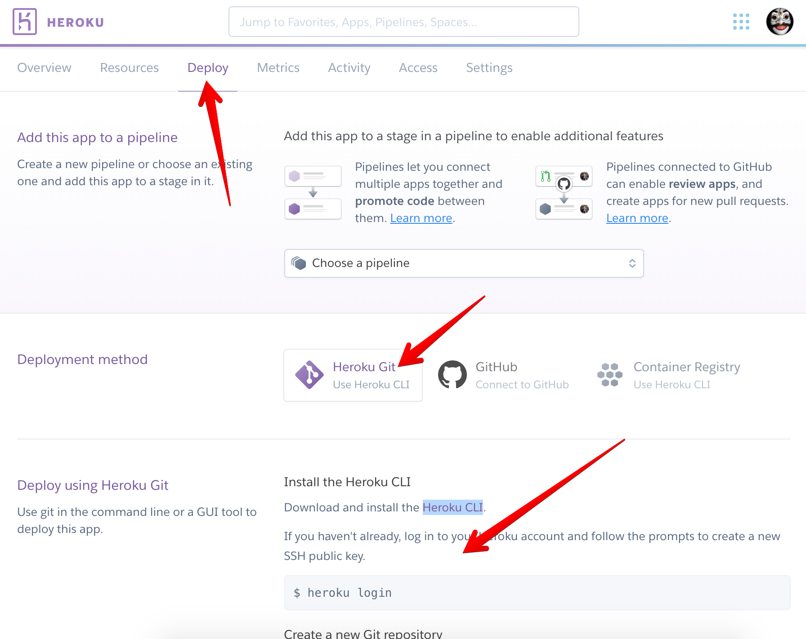

In this section we will build and deploy our todo application into [Heroku](www.heroku.com). Deploying to other host may take the different task.

## Build Project
Before start deploying the app, we need to build our project into JavaScript file. Project starter provided `build` and `postbuild` script to build the appropriate TypeScript file into `build` directory.

* From Visual Studio Code integrated terminal execute command below to build the project.

```bash
$ yarn build
```

* New directory named `build` will be created. Copy all content from `build` directory and drop it into directory that we will created below for deployment.

## Setup Heroku
There are some step need to do before we can deploy our todo application to Heroku
* Create Heroku app, the easiest way is from the [Heroku dashboard](https://dashboard.heroku.com/apps)
* Add JawsDB MySQL Add-ons from Resource tab. Note the add-ons is free but you need to activate your account by providing credit card to be able to use it. You can use PostgreSQL for free version without activation.


* Click the JawsDB MySQL hyperlink it will open in a new tab, than copy database connection string there.


* Install [Heroku CLI App](https://devcenter.heroku.com/articles/heroku-cli#download-and-install) match with your operating system.

* Follow Heroku app deployment step from Deploy tab. Copy all files inside `build` directory created on the build process and paste inside git repository created on this step. 



* Add configuration file `.env` and commit it to the heroku server.

## Execute DB Migration
We need to update database schema using migration, before that we need to update the `DB_URI` on the configuration pointing to the database.

* Open `.env` file and update the `DB_URI` using connection string we got from JawsDB. 
* From Visual Studio Code integrated terminal execute the migration

```bash
$ npx knex --knexfile knexfile.ts migrate:latest
```

* Still in the Visual Studio Code integrated terminal execute database seed to seed the default user

```bash
$ npx knex --knexfile knexfile.ts seed:run
```
