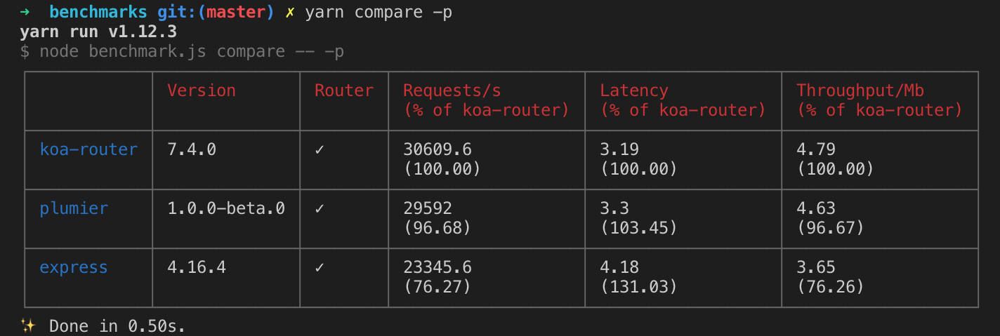

# Plumier
Delightful NodeJS Web Api Framework powered by KoaJs and TypeScript

[](https://travis-ci.org/ktutnik/plumier)
[](https://ci.appveyor.com/project/ktutnik/plumier)
[](https://coveralls.io/github/ktutnik/plumier?branch=master) 
[](https://greenkeeper.io/)
[](https://www.codacy.com/app/ktutnik/plumier?utm_source=github.com&amp;utm_medium=referral&amp;utm_content=ktutnik/plumier&amp;utm_campaign=Badge_Grade)

## Motivation
Plumier primarily created for full stack developer who spend more time working on the UI side and focus on creating a good user experience. Plumier comes with some built-in production-ready features that make creating secure JSON Api fun and easy.

### Lightweight
Plumier relatively has small code base which make it light and fast. It uses Koa as its core http handler which is quite fast, below is comparison result of Koa, Plumier and Express.



The benchmark project forked from Fastify benchmark project, you can test it your self [here](https://github.com/ktutnik/benchmarks).

### Flexible
Almost every part of framework is fully configurable and easy to override. For example plumier route generation system provided flexibility using convention and also configuration.

Plumier traverse through the controller directories and generate routes based on directory name, controller name, method name and parameter names. This behavior make you easily separate your controllers based on version etc.

```typescript
// path: controller/api/v1/users-controller.ts
export class UsersController {

    @route.put(":id")
    modify(id:number, data:User){
        //implementation
    }
}
```

Above class generated into

```
PUT /api/v1/users/:id
```

* `api` is a directory
* `v1` is a directory
* `user` is a controller `UsersController`
* `:id` is method parameter, the method name is ignored

Plumier has a flexible decorator based routing configuration, it makes you easily create clean restful api routes and nested restful api with separate controller. 

Check the [route cheat sheet](https://github.com/plumier/plumier/wiki/route-generation-cheat-sheet) for detail information

### Testing Friendly
Plumier controller is a plain TypeScript class it doesn't need to inherit from any base class, thats make it easily instantiated outside the framework. 

Plumier [parameter binding](https://github.com/plumier/plumier/wiki/parameter-binding) make it possible to bind specific part value of request into method's parameter which make the code more readable and easy to unit test. 

Controller doesn't need to interact with http response. It returns object or promised object that will automatically rendered as JSON with status response 200. To return an error response done by throwing `HttpStatusError`, its useful because you can throw error from nested helper function and it will caught by Plumier properly.


### Secure
- Type converter & Validator
- Token based auth
- Authorization
- Parameter Authorization


## Requirements
* TypeScript
* NodeJS >= 8.0.0
* Visual Studio Code

## Contributing
To run Plumier project on local machine, some setup/app required

### App requirements
* Visual Studio Code (Recommended)
* Nodejs 8+
* Yarn `npm install -g yarn`

### Local Setup
* Fork and clone the project
* Install dependencies by `yarn install`
* Run test by `yarn test`

### Debugging
Plumier already provided vscode `task` and `launch` setting. To start debugging a test scenario:
* Build the project 
* Locate the test file and narrow the test runs by using `.only`
* Put breakpoint on any location you need on `.ts` file 
* Locate the `.js` version of the test file that will be run **(important)**
* On start/debug configuration select `Jest Current File` and start debugging
* Process will halt properly on the `.ts` file.