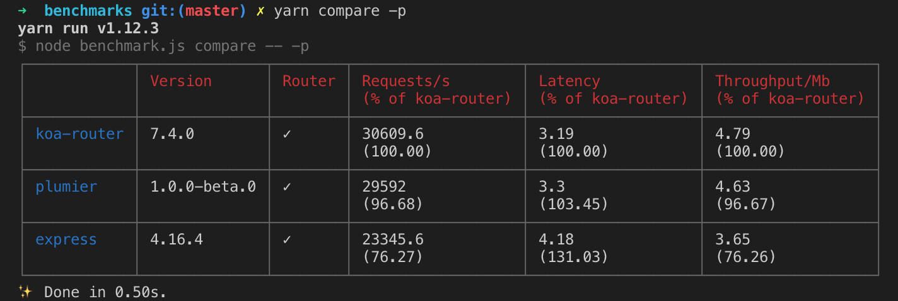
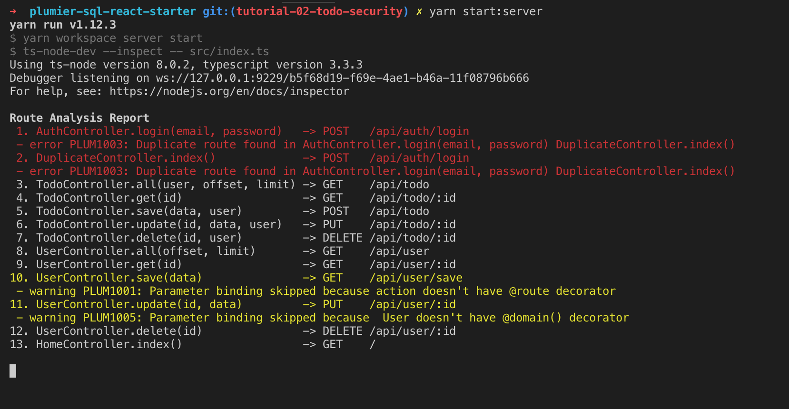

# Plumier
Delightful NodeJS Web Api Framework powered by KoaJs and TypeScript

[](https://travis-ci.org/ktutnik/plumier)
[](https://ci.appveyor.com/project/ktutnik/plumier)
[](https://coveralls.io/github/ktutnik/plumier?branch=master) 
[](https://greenkeeper.io/)
[](https://www.codacy.com/app/ktutnik/plumier?utm_source=github.com&amp;utm_medium=referral&amp;utm_content=ktutnik/plumier&amp;utm_campaign=Badge_Grade)

## Motivation
Plumier primarily created for full stack developer who spend more time working on the UI side and focus on creating a good user experience. Plumier comes with some built-in production-ready features that make creating secure JSON Api fun and easy.

### Lightweight
Plumier relatively has small code base which make it light and fast. It uses Koa as its core http handler which is quite fast, below is comparison result of Koa, Plumier and Express.



The benchmark project forked from Fastify benchmark project, you can test it your self [here](https://github.com/ktutnik/benchmarks).

### Flexible
Almost every part of framework is fully configurable and easy to override. For example plumier route generation system provided flexibility using convention and also configuration.

Plumier traverse through the controller directories and generate routes based on directory name, controller name, method name and parameter names. This behavior make you easily separate your controllers based on version etc.

```typescript
// path: controller/api/v1/users-controller.ts
export class UsersController {

    @route.put(":id")
    modify(id:number, data:User){
        //implementation
    }
}
```

Above class generated into

```
PUT /api/v1/users/:id
```

* `api` is a directory
* `v1` is a directory
* `user` is a controller `UsersController`
* `:id` is method parameter, the method name is ignored

Plumier has a flexible decorator based routing configuration, it makes you easily create clean restful api routes and nested restful api with separate controller. 

Check the [route cheat sheet](https://github.com/plumier/plumier/wiki/route-generation-cheat-sheet) for detail information

### Testing Friendly
Plumier controller is a plain TypeScript class it doesn't need to inherit from any base class, thats make it easily instantiated outside the framework. 

Plumier provided powerful [parameter binding](https://github.com/plumier/plumier/wiki/parameter-binding) to bound specific value of request object into method's parameter which eliminate usage of Request stub. Controller returned object or promised object or throw `HttpStatusError` and translated into http response which eliminate usage of Response mock.

```typescript
export class AuthController {
    @route.post()
    login(userName:string, password:string){
        const user = await userDb.findByEmail(email)
        if (user && await bcrypt.compare(password, user.password)) {
            return { token: sign({ userId: user.id, role: user.role }, config.jwtSecret) }
        }
        else
            throw new HttpStatusError(403, "Invalid username or password")
    }
}
```

Controller above uses [name binding](https://github.com/plumier/plumier/wiki/parameter-binding#name-binding), `userName` and `password` parameter will automatically bound with request body `{ "userName": "abcd", "password": "12345" }` or url encoded form `userName=abcd&password=12345`.

Testing above controller is as simple as testing plain object:

```typescript
it("Should return signed token if login successfully", async () => {
    const controller = new AuthController()
    const result = await controller.login("abcd", "12345")
    expect(result).toBe(<signed token>)
})

it("Should reject if provided invalid username or password", async () => {
    const controller = new AuthController()
    expect(controller.login("abcd", "1234578"))
        .rejects.toEqual(new HttpStatusError(403, "Invalid username or password"))
})
```

### Secure
Plumier provided built-in [type converter](https://github.com/plumier/plumier/wiki/converters), [validator](https://github.com/plumier/plumier/wiki/validation), [token based authentication](https://github.com/plumier/plumier/wiki/authorization), [declarative authorization](https://github.com/plumier/plumier/wiki/authorization#role-authorization) and [parameter authorization](https://github.com/plumier/plumier/wiki/authorization#parameter-authorization) which make creating secure JSON API trivial.

```typescript
@domain()
export class User  {
    constructor(
        @val.email()
        public email: string,
        public displayName: string,
        public birthDate: Date,
        @authorize.role("Admin")
        public role: "Admin" | "User"
    ) { }
}
```

Above is `User` domain that will be used as controller parameter type.  Its a plain TypeScript class using [parameter properties](https://www.typescriptlang.org/docs/handbook/classes.html#parameter-properties) decorated with some validation and parameter authorization. 

Plumier aware of TypeScript type annotation and will make sure user provided the correct data type, `@val.email()` will validate the email, `@authorize.role("Admin")` will make sure only Admin can set the role field.

```typescript
export class UsersController {
    private readonly repo = new Repository<User>("User")

    @authorize.role("Admin")
    @route.get("")
    all(offset: number, @val.optional() limit: number = 50) {
        return this.repo.find(offset, limit)
    }

    @authorize.public()
    @route.post("")
    save(data: User) {
        return this.repo.add(data)
    }
}
```

Above controller will generate routes below

```
POST /users
GET  /users?offset=0&limit=<optional>
```

Even if above controller implementation look so naive and vulnerable, but Plumier already done some security check before user input touching database. Get users route only accessible by Admin other user try accessing it will got 401 or 403 status. Save user is public so everyone can register to the service. 

Plumier done some data conversion and security check, example below is list of user input and their appropriate status

| User Input                                                                                                                    | Description                                      |
| ----------------------------------------------------------------------------------------------------------------------------- | ------------------------------------------------ |
| `{ "email": "john.doe@gmail.com", "displayName": "John Doe", "birthDate": "1988-1-1" }`                                       | Valid, `birthDate` converted to `Date`           |
| `{ "birthDate": "1988-1-1" }`                                                                                                 | Invalid, `email` and `displayName` is required   |
| `{ "email": "abc", "displayName": "John Doe", "birthDate": "1988-1-1" }`                                                      | Invalid email                                    |
| `{ "email": "john.doe@gmail.com", "displayName": "John Doe", "birthDate": "1988-1-1", "hack": "lorem ipsum dolor sit amet" }` | Valid, `hack` field removed                      |
| `{ "email": "john.doe@gmail.com", "displayName": "John Doe", "birthDate": "1988-1-1", "role" : "Admin" }`                     | Setting `role` only valid if login user is Admin |

### Friendly
Plumier enhanced with static route analysis which will print friendly message if you misconfigure controller or forgot some decorator.



## Documentation
Go to Plumier [wiki](https://github.com/plumier/plumier/wiki) for complete documentation and tutorial

## Requirements
* TypeScript
* NodeJS >= 8.0.0
* Visual Studio Code

## Contributing
To run Plumier project on local machine, some setup/app required

### App requirements
* Visual Studio Code (Recommended)
* Nodejs 8+
* Yarn `npm install -g yarn`

### Local Setup
* Fork and clone the project
* Install dependencies by `yarn install`
* Run test by `yarn test`

### Debugging
Plumier already provided vscode `task` and `launch` setting. To start debugging a test scenario:
* Build the project 
* Locate the test file and narrow the test runs by using `.only`
* Put breakpoint on any location you need on `.ts` file 
* Locate the `.js` version of the test file that will be run **(important)**
* On start/debug configuration select `Jest Current File` and start debugging
* Process will halt properly on the `.ts` file.