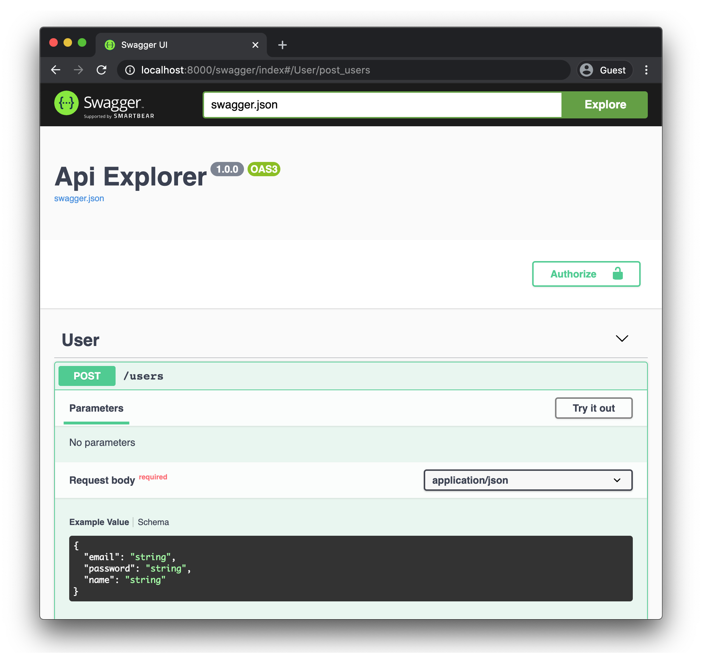

Plumier is A TypeScript backend framework focuses on development productivity with dedicated reflection library to help you create a robust, secure and fast API delightfully. 

### Map ORM Entities into CRUD APIs

Plumier provided generic controllers to increase your productivity developing secure Restful API. Generic controllers are reusable controllers with a generic type signature, its take advantage of reflection and inheritance to provide Restful CRUD function with some useful operation such as filtering, ordering and response projection out of the box. Using it you will be able to create CRUD API rapidly based on your ORM entities (TypeORM entity, Mongoose with mongoose helper).

Generic controllers are highly customizable, you can define your own route path, disable some routes, hook the saving process and even you can provide your own custom generic controller. 

You use generic controller by decorating your entity with `@route.controller()` then Plumier automatically create derived generic controller based on your entity on the fly. 

```typescript {4}
import { route } from "plumier"
import { Entity, Column, CreateDateColumn, PrimaryGeneratedColumn } from "typeorm"

@route.controller()
@Entity()
export class Post {
    @PrimaryGeneratedColumn()
    id: number

    @Column()
    slug:string

    @Column()
    title:string

    @Column()
    content:string

    @CreateDateColumn()
    createdAt:Date
}
```

Above code is a common TypeORM entities marked with Plumier decorators. The `Category` entity marked with `@route.controller()` it tells Plumier that the entity should be handled by a generic controller. 

Code above will generated into routes that follow Restful best practice like below.

| Method | Path                               | Description                                         |
| ------ | ---------------------------------- | --------------------------------------------------- |
| POST   | `/posts`                           | Create new post                                     |
| GET    | `/posts?offset&limit&select&order` | Get list of posts with paging, order and projection |
| GET    | `/posts/:id?select`                | Get single post by id with projection               |
| PUT    | `/posts/:id`                       | Replace post  by id                                 |
| PATCH  | `/posts/:id`                       | Modify post property by id                          |
| DELETE | `/posts/:id`                       | Delete post by id                                   |


### Define Filterable Fields
Generic controller provided functionalities to refine the API response, such as filter, paging, order and projection. By default filter will not enabled, you need to decorate the filterable fields. 

```typescript {10,14,21}
import { route, authorize } from "plumier"
import { Entity, Column, CreateDateColumn, PrimaryGeneratedColumn } from "typeorm"

@route.controller()
@Entity()
export class Post {
    @PrimaryGeneratedColumn()
    id: number

    @authorize.filter()
    @Column()
    slug:string

    @authorize.filter()
    @Column()
    title:string

    @Column()
    content:string

    @authorize.filter()
    @CreateDateColumn()
    createdAt:Date
}
```

Above code enabled filters for `slug`, `title` and `createdAt` fields. Using above generated API you may request like below.

```bash
# Filter response based on slug property using equals comparison
GET /posts?filter[slug]=my_cool_post

# Perform range filter between dates using triple dots
GET /posts?filter[createdAt]=2020-9-1...2020-10-1

# Perform conditional filter (greater or equal than 9/1/2020)
GET /posts?filter[createdAt]=>=2020-9-1

# Perform search on title that starts with word programming using asterisk
GET /posts?filter[title]=programming*

# Perform search on title that ends with word programming using asterisk
GET /posts?filter[title]=*programming

# Paginate response to narrow filter result 
GET /posts?offset=20&limit=50

# Order response by createdAt desc and slug asc
GET /posts?order=-createdAt,slug

# Select only title and content visible on response 
GET /posts?select=title,content
```

### Map One To Many Into Nested CRUD API

ORM entities may contains relations to represent join to another table, Plumier provided nested generic controller to perform parent children  operation easily.

```typescript {11}
import { route } from "plumier"
import { Entity, OneToMany, PrimaryGeneratedColumn } from "typeorm"

@Entity()
export class Post {
    @PrimaryGeneratedColumn()
    id: number

    /** other properties **/

    @route.controller()
    @OneToMany(x => Comment, x => x.post)
    comments: Comment[]
}

@Entity()
export class Comment {
    @PrimaryGeneratedColumn()
    id: number

    @ManyToOne(x => User)
    user: User 

    @Column()
    comment:string

    @ManyToOne(x => Post, x => x.comments)
    post:Post
}
```

Above code showing that the relation property `comments` marked with `@route.controller()` decorators. It tells Plumier to create a nested generic controller to perform parent children operation. Above code will generated into routes below.

| Method | Path                       | Description                                                           |
| ------ | -------------------------- | --------------------------------------------------------------------- |
| POST   | `/posts/:pid/comments`     | Create new post's comment                                             |
| GET    | `/posts/:pid/comments`     | Get list of post's comments with paging, filter, order and projection |
| GET    | `/posts/:pid/comments/:id` | Get single post's comment by id with projection                       |
| PUT    | `/posts/:pid/comments/:id` | Replace post's comment  by id                                         |
| PATCH  | `/posts/:pid/comments/:id` | Modify post's comment property by id                                  |
| DELETE | `/posts/:pid/comments/:id` | Delete post's comment by id                                           |

To do the parent children operation on Post and Comment its required to use the Post ID on the route parameter. Then your POST request to create a new comment to specific post is like below

```bash
# create new comments for Post with ID 12345
POST /posts/12345/comments HTTP/1.1
Host: localhost:8000
Content-Type: application/json
{ "user": 5678, "comment": "Great article" }
```

Above request will add comment to the post with ID `12345`. Note that the `user` property can be filled with User ID `5678`.


Nested generic controller also supported filter parameter to refine the response result explained earlier. 

:::info Documentation
Read more detail information about Generic Controller in this [documentation](Generic-Controller.md)
::::

### Securing Data Based on User Role 

Plumier has a powerful authorization system to protect your API endpoints and data based on your user roles. The authorization can be enabled by installing `JwtAuthFacility`.

:::info
Facility is a component used to configure Plumier application to add a new functionalities. It consist of ordered middlewares, some initialization process before the application started and some application configurations. Facility installed on application bootstrap like below.

```typescript
new Plumier()
  .set(new WebApiFacility()) //install API functionalities
  .set(new JwtAuthFacility()) //install authorization functionalities
```
:::

Before proceeding on security functionality, its important to notice that Plumier role system is depends on the JWT claim named `role`. You define the login user role by specify user role during JWT signing process like below.

```typescript {13}
import { route } from "plumier"
import { sign } from "jsonwebtoken"

export class AuthController {
    // POST /auth/login
    @route.post()
    async login(email:string, password:string) {
        // other login process
        const user = await repo.findByEmail(email)
        const token = sign({ 
          userId: user.id,
          // role claim is mandatory 
          role: user.role, 
        }, process.env.YOUR_JWT_SECRET)
        return { token }
    }
}
```

Role claim can be any string such as `SuperAdmin`, `Supervisor`, `Staff`, `Admin`, `User` etc. Further more this roles can be used to secure your API endpoints or data using `@authorize` decorator like below 

```typescript {7,8,19}
import { route, authorize } from "plumier"
import { Column, Entity, PrimaryGeneratedColumn } from "typeorm"

// only Supervisor and Manager has access to the 
// post, patch, put, delete route endpoints
@route.controller(config => {
  config.actions("Post", "Put", "Patch", "Delete")
        .authorize("Supervisor", "Manager")
})
@Entity()
export class Item {
    @PrimaryGeneratedColumn()
    id: number

    @Column()
    name: string

    // only Supervisor and Manager can see basePrice on response result
    @authorize.read("Supervisor", "Manager")
    @Column()
    basePrice: string

    @Column()
    price: string
}
```

Code above showing that the entity handled by a generic controller and decorated with some `@authorize` decorators. It will be generated into routes below.

| Method | Path         | Accessible By       | Description                                                 |
| ------ | ------------ | ------------------- | ----------------------------------------------------------- |
| POST   | `/items`     | Supervisor, Manager | Create new post                                             |
| GET    | `/items`     | Any login user      | Get list of items with paging, filter, order and projection |
| GET    | `/items/:id` | Any login user      | Get single post by id with projection                       |
| PUT    | `/items/:id` | Supervisor, Manager | Replace post  by id                                         |
| PATCH  | `/items/:id` | Supervisor, Manager | Modify post property by id                                  |
| DELETE | `/items/:id` | Supervisor, Manager | Delete post by id                                           |

Note that route with http method `POST`, `PUT`, `PATCH`, `DELETE` only authorized to the `Supervisor` and `Manager` role, while the `GET` endpoints (get by id, and list) authorized to all login users. 

The `basePrice` decorated with `@authorize.read()` which will show/hide the response result based on user role. Its mean the `basePrice` will only visible to `Supervisor` and `Owner`  

There are more authorization decorator available

| Decorator                            | Description                                                      |
| ------------------------------------ | ---------------------------------------------------------------- |
| `@authorize.write(<role or policy>)` | Protect property only can be write by specific role              |
| `@authorize.read(<role or policy>)`  | Protect property only can be read by specific role               |
| `@authorize.readonly()`              | Protect property only can be read and no other role can write it |
| `@authorize.writeonly()`             | Protect property only can be write and no other role can read it |

:::info documentation 
Refer to [this documentation](Authorization.md) to get detail information about authorization
:::

:::info documentation 
Refer to [this documentation](Generic-Controller.md#control-access-to-the-generated-routes) to get detail information on securing generic controller routes. 
:::


### Validate User Data Declaratively 

Plumier provided comprehensive list of validator, uses [ValidatorJS](https://www.npmjs.com/package/validator) internally. You specify validation using `@val` decorator. 

```typescript {9-11,15,19}
import { val } from "plumier"
import { Entity, Column, CreateDateColumn, PrimaryGeneratedColumn } from "typeorm"

@Entity()
export class User {
    @PrimaryGeneratedColumn()
    id: number

    @val.email()
    @val.unique()
    @val.required()
    @Column()
    email: string

    @val.required()
    @Column()
    name:string

    @val.url()
    @Column()
    profilePicture:string
}
```

There are more than 40 validators to use to secure your API consumer request. 

:::info
Refer to [validator documentation](Validation.md) for more information 
:::

### Generate Open API 3.0 Schema from Controllers

Plumier provided `SwaggerFacility` to automatically generate Open API 3.0 schema from both controller and generic controller. Open API 3.0 Schema automatically generated by reading and transforming controller's metadata on the fly. 

```typescript {5}
import { SwaggerFacility } from "@plumier/swagger"

new Plumier()
  /* other facilities */
  .set(new SwaggerFacility()) 
```

The generated Open API 3.0 schema can be customized minimally, but mostly everything will just work out of the box. `SwaggerFacility` hosts the SwaggerUI under `/swagger` endpoint.



### Handle Complex Request with Common Controller

Generic controller is just an implementation of Plumier controller with generic class signature. Even though generic controller can be fully customized to match your app requirements, in some case its may required to use a controller manually to handle user request. 

The term of Controller in Plumier is the same as in other MVC framework. Plumier controller is a plain class end with `Controller` for example `class UsersController`. A route automatically generated based on `/controller/action`. This behavior can be customized using `@route` decorator.

```typescript
import { route } from "plumier"

export class UsersController {
    // GET /users/:id
    @route.get(":id")
    get(id:string) { 

      // return value or Promise that 
      // automatically rendered into JSON response
      return repo.findOne(id)
    }
}
```

Controller can return any value including `Promise`, this value then rendered into JSON response automatically. You can have more control to the response by returning the `ActionResult` or use the built-in `response` function.

| Action                 | Alias                 | Description                | Package                 |
| ---------------------- | --------------------- | -------------------------- | ----------------------- |
| `ActionResult`         | `response.json()`     | Return json response       | `plumier`               |
| `RedirectActionResult` | `response.redirect()` | Redirect response          | `plumier`               |
| `FileActionResult`     | `response.file()`     | Serve static file response | `@plumier/serve-static` |

:::info documentation
Refer to the complete documentation about [routing](Route-Generation-Cheat-Sheet.md)
:::

### Bind Request Part Into Action's Parameter
Action parameter can be bound into request part such as query, body, header etc. Request values received automatically converted into data type match with action parameter data type. 

```typescript
import { route } from "plumier"

export class UsersController {
    // GET /users/list
    @route.get()
    list(offset:number = 0, limit:number = 50, active:boolean = true) {
        
    }
}
```

Above controller generated into `GET /users/list?limit&offset&active`. All parameters are optional with their default values. Note that the value automatically converted match with parameter data type, giving these request are valid

```
GET /users/list 
GET /users/list?limit=20
GET /users/list?offset=20&limit=20
GET /users/list?offset=10&active=true
GET /users/list?active=1
```

Important to notice that boolean parameter can be filled with: `yes`, `no`, `true`, `false`, `1`, `0`. And parameter of type datetime can be filled with `2020-12-31` or `2020-10-05T23:28:33.598Z` 

Parameters also can be bound with request body by providing a parameter of type of custom object to hold the request body like example below

```typescript
import { route, domain } from "plumier"

@domain()
export class Login {
    constructor(
        public email:string,
        public password:string,
    ){}
}

export class AuthController {
    // POST /auth/login
    @route.post()
    login(data:Login) {
        
    }
}
```

Above controller will be generated into `POST /auth/login` with request body `{ "email":<string>, "password": <string> }` 

Plumier provided decorators to bind specific request body to parameter, you can use the `@bind` decorator on specific parameter. 

```typescript {6}
import { route, bind } from "plumier"

export class UsersController {
    // GET /users/:id
    @route.get(":id")
    get(id:string, @bind.user() user:LoginUser) { }
}
```

Here are list of supported parameter binding decorators 

| Binding           | Description                                                                                                             |
| ----------------- | ----------------------------------------------------------------------------------------------------------------------- |
| `@bind.user()`    | Bind current login user (JWT claims) into parameter                                                                     |
| `@bind.ctx()`     | Bind request context into parameter                                                                                     |
| `@bind.request()` | Bind request into parameter                                                                                             |
| `@bind.body()`    | Bind request body into parameter (optional, or use a custom class type to automatically bind request body to parameter) |
| `@bind.query()`   | Bind request query into parameter                                                                                       |
| `@bind.header()`  | Bind request header into parameter                                                                                      |
| `@bind.cookie()`  | Bind request cookie into parameter                                                                                      |
| `@bind.custom()`  | Bind custom parameter binding implementation into parameter                                                             |

:::info documentation
Refer to the complete documentation about [parameter binding](Parameter-Binding.md) and [type converter](Converters.md)
:::

### Plug Facilities Into Application Bootstrap

The entry point of Plumier application is an instance of `Plumier`. `Plumier` consist of features that can be enabled/disabled by installing `Facility`. 

```typescript
import { JwtAuthFacility } from "@plumier/jwt"
import { SwaggerFacility } from "@plumier/swagger"
import { TypeORMFacility } from "@plumier/typeorm"
import Plumier, { WebApiFacility, ControllerFacility } from "plumier"

new Plumier()
    .set(new WebApiFacility())
    .set(new ControllerFacility({ 
      controller: "./**/*controller.{ts,js}", 
      rootPath: "api/v1"
    }))
    .set(new JwtAuthFacility())
    .set(new TypeORMFacility())
    .set(new SwaggerFacility())
    .listen(8000);
```

Above code will start Plumier application with some installed features and listens to the port 8000. Plumier provided some facilities for development convenient they are:

| Facility              | Includes                                                                               | Package                 |
| --------------------- | -------------------------------------------------------------------------------------- | ----------------------- |
| `WebApiFacility`      | Body parser, CORS middleware, Default dependency resolver                              | `plumier`               |
| `RestApiFacility`     | Same as `WebApiFacility` except its provided more strict restful API status code       | `plumier`               |
| `ControllerFacility`  | Host controllers by path or type, furthermore controllers can be grouped and versioned | `plumier`               |
| `LoggerFacility`      | Simple request logging and error reporting                                             | `plumier`               |
| `JwtAuthFacility`     | Jwt middleware, Enable authorization, Jwt Secret configuration                         | `@plumier/jwt`          |
| `MongooseFacility`    | Mongoose schema generator, generic controller and connection management                | `@plumier/mongoose`     |
| `TypeORMFacility`     | Provided helper and generic controller for TypeORM                                     | `@plumier/typeorm`      |
| `ServeStaticFacility` | Serve static files middleware                                                          | `@plumier/serve-static` |
| `SwaggerFacility`     | Serve Swagger UI and generate Open API 3.0 automatically                               | `@plumier/swagger`      |


### Layout Your Source Code Freely
Plumier doesn't strictly provided the project layout, but it provided flexibility to layout your project files match your need. Below are some common project structure usually used by developers, You can choose any of them match your like.

### Single File Style
This style usually used by Express for small app with a fewer code. Put all controllers and entities in a single file and configure the bootstrap application like below.

```typescript
new Plumier()
    .set(new WebApiFacility({ controller: ___filename }))
    .listen(8000)
```

By providing `__filename` you ask Plumier to search your controllers in the same file. 

### Classic MVC Style 
This is default style supported by Plumier. Classic MVC style app separate project files by functionalities such as `controllers`, `models`, `repositories`, `entities`, `services` etc.

```
+ src/
  + controller/
    - item.controller.ts
    - user.controller.ts
  + repository/
    - item.repository.ts
    - user.repository.ts
  + service/
    - item.service.ts
    - user.service.ts
  + entity/
    - item.entity.ts
    - user.entity.ts
  - app.ts
  - index.ts
- package.json
- tsconfig.json
```

No more setup required to use this style.

```typescript
new Plumier()
    .set(new WebApiFacility())
    .listen(8000)
```

### Modular Style 
This style usually used by modern frameworks, files separated by module per directory, each directory consist of controller, model, service, entity etc separated in different files. 

```
+ src/
  + item/
    - item.controller.ts
    - item.entity.ts
    - item.service.ts
    - item.repository.ts
  + user/
    - user.controller.ts
    - user.entity.ts
    - user.service.ts
    - user.repository.ts
  - app.ts
  - index.ts
- package.json
- tsconfig.json
```

Use `ControllerFacility` to locate the controller location. Plumier will automatically search through all files to find controllers.

```typescript
new Plumier()
    .set(new WebApiFacility())
    .set(new ControllerFacility({ controller: "./*/*.controller.{ts,js}" }))
    .listen(8000)
```
