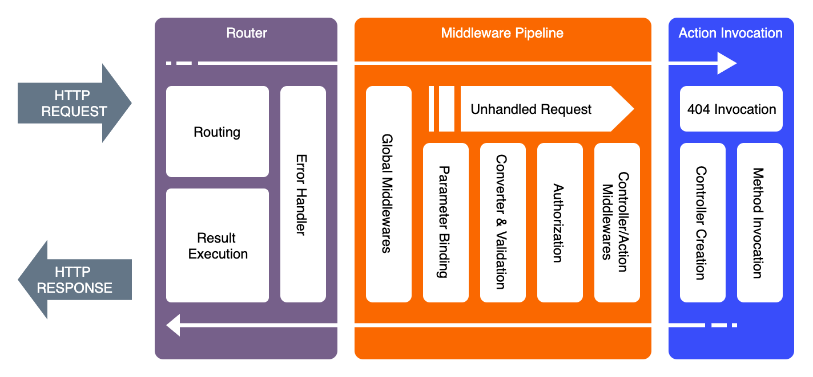
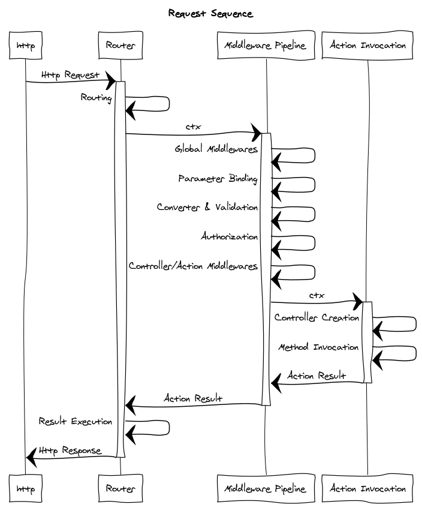

When an Http Request issued into Plumier application, the process goes through a series of processing steps that can be categorized into three main process. Infographic picture below showing the various stage of Plumier Application Life Cycle.

Above picture showing the Plumier components, the lifecycle sequence start from left to right then return back to left after execution done.

## Router 
Router is the main process during the occurrence of the http request. There three main process inside router are: 

### Routing
Routing will parse the request URL into path and query object using RegEx and specify the correct controller that will handle the request. 

There are `Context` variable (`ctx`) initialized during this phase. `ctx` accessible from middleware using `invocation.ctx`

1. `ctx.route` contains route metadata information such as controller name, current method name, parameters, route etc. The value can be `undefined` if the current request doesn't associated with any controller.
2. `ctx.request.query` contains request query string in query form. 
3. `ctx.config` contains Plumier application configuration.
4. `ctx.routes` contains all routes metadata information, this values got during route generation process on initialization process.

All above context property only accessible within process after the routing. 

### Result Execution 
Router executes middleware pipeline and wait for the returned `ActionResult`. Action result contains raw values will be used to render the Http Response such as request body, headers, cookies etc. 

Result execution process executes the `ActionResult` by calling its `execute` method and render the Http Response.

### Error Handler 
Router surrounded with a global try-catch to catch all thrown error inside the next phases (Middleware Pipeline and Action Invoker). 

All uncaught error usually translated into Http Response with status 500 except using `HttpStatusError` or `ValidationError` will result different http status.

## Middleware Pipeline 
Middleware pipeline executes middlewares using stack-like sequence. Basically its works like Koa middleware pipeline. The first middleware has full control of the next invocation (can be another middleware execution or a controller execution). 

It can execute next invocation using some condition such as check for login user or check some query string before proceeding. Further more middleware can modify execution result that will be used to create http response, such as modify the response body, response status etc.

Middleware executed inside middleware pipeline has a sequence like below: 

### Global Middlewares
All global middlewares: middleware that registered using application `use` method or registered using `Facility` will be executed first. 

### Parameter Binding Middleware
Parameter binding middleware will translate request values (body, header, cookie, query string etc) into parameter values. Parameter binding mutate the `ctx` property used to save the result. `ctx.parameters` will store the raw (not converted nor validated) value of the parameter binding. 

### Converter & Validation middleware
Converter and Validation middleware will convert the `ctx.parameters` raw value created by parameter binding into appropriate datatype match with controller's method parameter type. The conversion result replaces the `ctx.parameters` created by parameter binding with those cleansed values.

Converter and Validation will throw `ValidationError` and rendered into Http Response with 422 status code.

During creation of custom converter, Plumier uses dependency resolver to create instance of the custom converter. This behavior can be extended using custom dependency resolver with dependency injection framework of the choice.

### Authorization Middleware
Authorization Middleware will restrict access to a controller's method, its disabled by default. Authorization can be activated by setting the `enableAuthorization` on Plumier configuration, or by installing `JwtAuthFacility`. 

Authorization will throw `HttpStatusError` with status code 403 Forbidden and 401 unauthorized

Plumier also uses dependency resolver to create instance of custom authorization for dependency injection.

### Controller / Method Middleware 
Controller / Method middleware is middleware registered using `@middleware.use()` decorator above the controller or method declaration. Controller / Method middleware can use the `ActionContext` and has access to `ctx.parameters` with a cleansed value.

## Action Invoker
Action invoker execute the controller's method handle the request. Action invoker is an optional phase, but most important and complex phase. 

Inside Action Invoker, request context `Context` class mutated with a new `parameters` property. There is a derived class of `Context` can be used for convenient named `ActionContext`

### Controller Creation 
Controller creation is an important phase because it uses dependency resolver to create instance of the controller. This phase always happened on every request that has controller handler.

### Method Invocation
Method invocation will invoke the appropriate method handles the request using the `ctx.parameters` values. This method invocation process returned promised `ActionResult` even if the method returned a non `ActionResult` value.